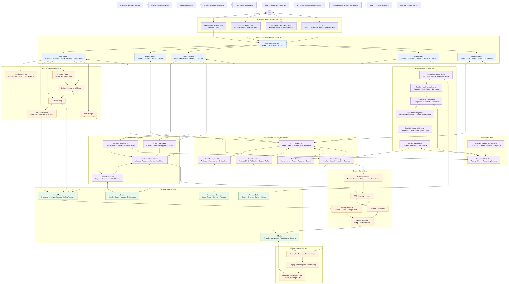
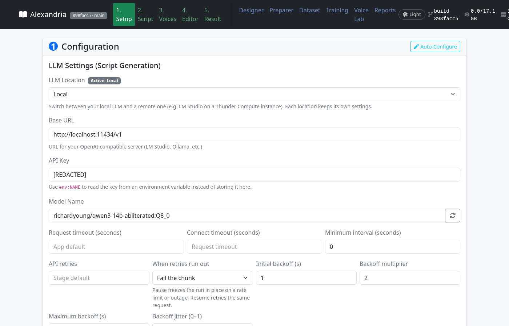
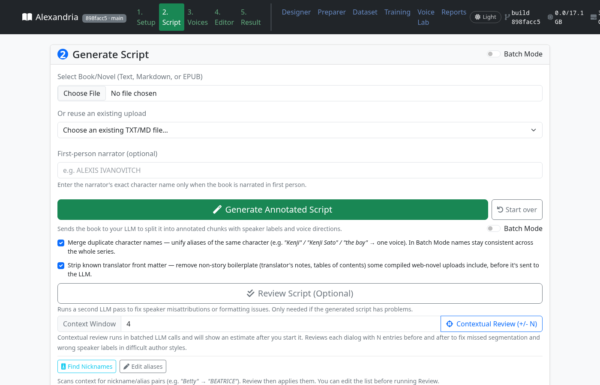
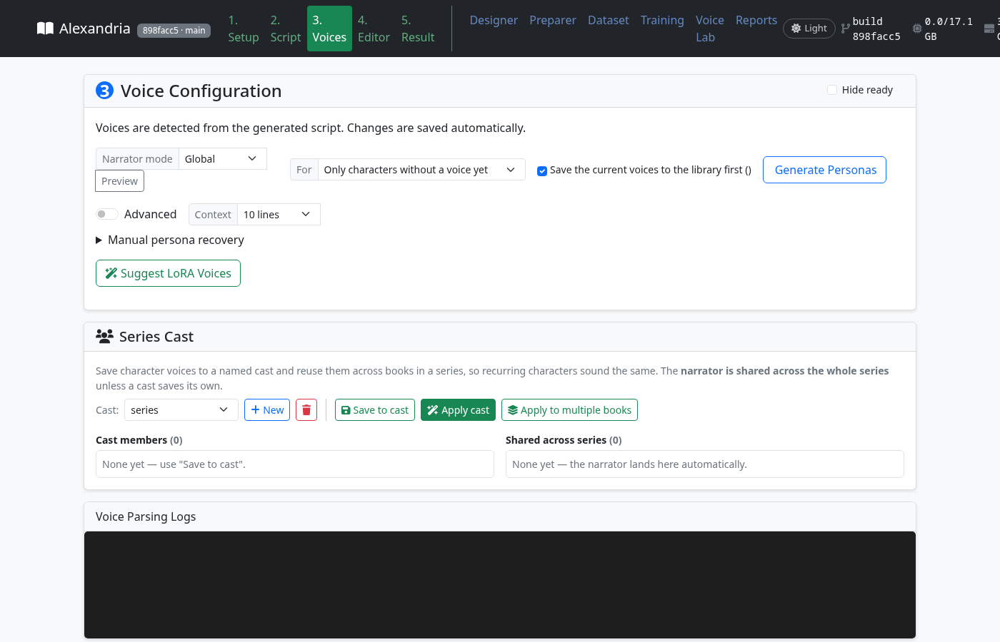
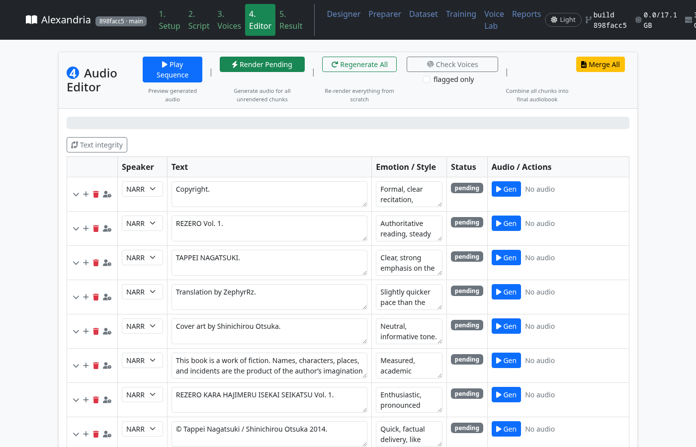

<p align="center">
  
</p>

# Alexandria Audiobook2

English | [中文](README_CN.md) · [Listen to a sample](https://github.com/user-attachments/files/25276110/sample.mp3)

A research fork of [Alexandria](https://github.com/Finrandojin/alexandria-audiobook)
that turns a book into a multi-voice audiobook — and **measures every choice
along the way**: which model and prompt assign speakers correctly on annotated
gold, how close a synthetic voice gets to a human reading, whether Japanese
pitch accent survives synthesis. The settings that won are the defaults —
the `michel2_full` attribution prompt became the shipped default on
2026-09-19, the day the last base confirmed it — and every alternative stays
selectable in Setup. The numbers, the failures and the recipes are in the
repo, not in a blog post.

**[GOALS.md](GOALS.md)** — what "good" means, per goal, with the current
measurement · **[RECIPES.md](RECIPES.md)** — the training and serving
settings that produced working results, each with its look-alike failure ·
**[RESULTS_INDEX.md](RESULTS_INDEX.md)** — every experiment artifact ·
**[Adapters on Hugging Face](https://huggingface.co/Om22s/alexandria-qwen3-attribution)**
· **[HF_MODEL_GUIDE.md](HF_MODEL_GUIDE.md)** — how those are released

## New here? Start with the path that fits you

| I want to… | Start here |
|---|---|
| **Try the audiobook app** | [Install](#installation), then follow [your first audiobook](#beginners-guide-your-first-audiobook). |
| **Understand the evaluation results** | Read [results at a glance](#results-at-a-glance), then the [Muse quant comparison](docs/results/muse-quant-baselines.md) and [evaluation recipes](RECIPES.md). |
| **Find a particular run or its raw data** | Search the [results index](RESULTS_INDEX.md); each entry links to the committed artifact. |
| **Browse the supporting documentation** | Use the [documentation map](docs/README.md) to find user guides, operations notes, results, and history. |
| **Understand the project or contribute** | Start with the [project wiki](https://github.com/on22s/alexandria-audiobook2/wiki), then [contributing](#contributing) and [goals](GOALS.md). |

The app guide, research results, and development notes serve different purposes;
you do not need to read the research sections to install or use the app.

## Results at a glance

Everything below is measured on fixed fixtures with a paired control, and each
number names its fixture. They are benchmark results, not guarantees about
your book.

### Who says which line — attribution accuracy

The four-book product fixture is 768 speaker-labelled dialogue rows from four
translated Japanese light novels, scored through the app's own three-pass
pipeline at temperature 0 with a JSON schema. The prompt shape is the largest
single lever this project found; the `michel2_full` variant (a surrounding
block of 2,000 characters around each request, after Michel et al.'s
formulation) wins on every base measured. Base models, no adapter, reasoning
low (RECIPES §"Prompt variants × bases", 2026-09-18):

| base model | file | default prompt | `michel2_full` | notes |
|---|---:|---:|---:|---|
| DeepSeek v4-pro (API, thinking off) | — | 91.1 | **94.9** | thinking low, 8k: **95.4** — the cloud ceiling, ~$0.50–0.75 per run of the fixture |
| Qwen3.8-27B UD-Q4_K_M | 16.5 GB | 82.9 | 89.8 | `michel2` **90.9** — the best local number on record |
| Qwen3.6-35B-A3B UD-Q4_K_XL | 22.4 GB | — | **89.6** | IQ3_XXS (13.2 GB) and IQ2_XXS (10.8 GB) hold 91.6 / 90.5 on nine PDNC novels |
| Muse-Glimmer-30B UD-Q3_K_XL | 13.4 GB | 81.5 | **90.5** | the shipped base; `michel2` 86.6; without reasoning 72.1 |
| Qwen3-14B Q4_K_M | 9.0 GB | 66.1 | **82.0** | +16 from the prompt alone, the largest gain of any base |
| Qwen3.5-9B / Qwen3-8B Q4_K_M | 5–6 GB | 62.6 / 60.8 | 71.9 / 71.7 | both collapse on the hardest book |

On the separate nine-novel PDNC panel, the completed Muse base-only quant
comparison is **93.33% (Q3)** and **94.61% (Q4)** across 2,655 rows. This is a
different fixture from the four-book table above; see the [full comparison and
artifacts](docs/results/muse-quant-baselines.md).

Separately, paid OpenRouter base-only runs of Nemotron 3 Ultra scored 96.7%
on *Mansfield Park*, 97.6% on *Northanger Abbey*, 97.1% on *Persuasion*,
85.3% on *The Sign of the Four*, and 87.3% on *The Sun Also Rises*.
These are per-book API baselines, not a pooled score or adapter comparison;
the provider-routing caveat and artifacts are documented in
[RECIPES.md](RECIPES.md#september-22-follow-up-low-quant-adapter-and-nemotron-api-baselines).

**Local vs cloud** (goal 4.2, best local arm per book against DeepSeek's
best): 97.3% / 97.5% / 94.5% / 92.9% of the cloud number on the four books.
Two books sit outside the 5% band the goal asks for; the adapters below are
the work on that.

### Which model for your card

Same measurement as above — nine novels, 2,655 rows, `michel2_full`, no adapter.
Full ladder and the reasoning: [Which model for your card](docs/wiki/Which-Model-For-Your-Card.md).

| your card | run this | file | base | adapter? |
|---|---|---:|---:|---|
| 16–24 GB | Qwen3.8-27B UD-Q3_K_XL | 12.5 GB | **95.2%** | **yes — 96.0%** |
| 12 GB | Muse-Glimmer-30B IQ3_XXS | 10.6 GB | 92.6% | **no** (−3.6) |
| 8–10 GB | Qwen3.8-27B UD-IQ2_XXS | 6.9 GB | 88.7% | untested here |
| 6 GB | not yet measured | — | — | — |

**Adapters usually lose.** Of every paired nine-novel run, only the Qwen3.8-27B
adapter gains (+0.8 to +2.5); A3B and Muse adapters cost between 3.2 and 27.5
points. Load one only at a rung where it is measured to help.

Three measured surprises: **Q3_K_XL beats Q4_K_M** on Qwen3.8 (95.2 vs 94.9) for
3 GB less, so don't pay for Q4; a **small quant of a big model beats a big quant
of a small model** (27B at IQ2_XXS, 6.9 GB, 88.7% vs 14B at Q4_K_M, 9.0 GB,
84.3%); and **context length, not file size, decides whether a model fits** — the
same 5.4 GB model needs 5.1 GB at `-c 4096` and 11.3 GB at `-c 32768`, while the
product prompt's longest window is 5,966 tokens, so `-c 8192` is enough.

### Adapters — trained on rights-clean data only

LoRA adapters for the attribution task, trained on 20 public-domain PDNC
novels, RiQuA and CC0 play scripts rendered as prose (no light-novel text,
nothing you could not redistribute). Public on the Hub:
[Om22s/alexandria-qwen3-attribution](https://huggingface.co/Om22s/alexandria-qwen3-attribution).

| adapter | base GGUF / size | reasoning | nine PDNC novels (2,655 rows) | four-book fixture | Emma (held out, 318 rows) |
|---|---|---|---:|---:|---:|
| Qwen3.8-27B `michel2` | IQ2_XXS 7.3 GB | on | queued | 83.1 → **85.7 (+2.6)** | 91.2 → 92.1 |
| Qwen3.8-27B `michel2` | Q3_K_XL 13.1 GB | on | queued | 87.5 → **88.8 (+1.3)** | 99.4 → 99.7 |
| Qwen3.8-27B `michel2` | Q4_K_M 16.5 GB | on | 94.9 → **95.9 (+1.0)**; strict paired p=0.057 | 89.8 → 89.8 | 99.7 → 99.4 |
| Qwen3.8-27B `michel2` | Q4_K_M 16.5 GB | off | 93.5 → **95.8 (+2.4)**; held-out eight: 94.9 → **97.1** | 87.4 → **88.3 (+0.9)** | 99.1 → 99.1 |
| Qwen3.6-35B-A3B `michel2` | IQ1_M 10.0 GB | off | 89.4 → 85.7 (−3.7); held-out eight: 91.4 → 88.9 | 82.9 → **85.9 (+3.0)** | 97.8 → 96.2 |
| Qwen3.6-35B-A3B `michel2` | IQ1_M 10.0 GB | on | queued | 87.5 → 85.0 (−2.5) | 96.2 → 98.1 |
| Qwen3.6-35B-A3B `michel2` | IQ2_XXS 10.8 GB | on | 91.6 → 88.3 raw; 91.3 offline echo-strip | 88.3 → 87.9 (−0.4) | 95.6 → 95.3 |
| Qwen3.6-35B-A3B `michel2` | IQ3_XXS 13.2 GB | on | 91.6 → 71.3 raw / **90.9 app-read** | 87.5 → 86.6 (−0.9) | 95.6 → 82.7 raw / 93.1 app-read |
| Qwen3.6-35B-A3B `michel2` | Q4_K_XL 22.4 GB | on | 92.1 → 64.6 raw; 91.9 offline echo-strip | 90.8 → 88.5 (−2.2) | 96.9 → 95.3 raw / 98.1 app-read |
| Qwen3-14B rights-clean, seed 1, `default` | Q4_K_M 9.0 GB | low, budget 1024 | 67.6 → **72.6 (+5.0)**; held-out-eight replication 72.2 → **74.9 (+2.7)** | 66.1 → **74.7 (+8.6)** | 68.9 → 75.8 |
| Qwen3-14B rights-clean, seed 2, `default` | Q4_K_M 9.0 GB | low, budget 1024 | queued | 66.1 → **74.9 (+8.8)** | 68.9 → 69.5 |
| Qwen3-14B rights-clean, seed 1, `michel2_full` | Q4_K_M 9.0 GB | low, budget 1024 | 84.3 → 84.3 (+0.1) | — | 89.6 → 95.9; P&P 88.9 → 77.0 |
| Muse Gen 3 RFT, `michel2_full` | Q3_K_XL 13.4 GB | low | eight-novel pilot, 631 rows: scale 0.25 **92.9 → 96.0**; 0.5 null; 1.0 92.9 → 89.4 | — | — |

Every nine-novel cell uses the same fixed panel, 40 windows per novel and
2,655 labelled rows. `queued` means that exact paired measurement is running,
not that a four-book result was silently substituted. The Sun Also Rises is
one of the 20 training novels, so the nine-novel column is a consistent stress
test rather than a purely held-out estimate; Emma remains the clean held-out
check. Four-book rows are 768 paired rows on one server with the adapter scale
toggled (RECIPES §"Attribution adapters", 2026-09-20). The adapters were built
to lift the base models — the prompt did most of that — so their job now is
**how small a quant can ship**, and the answer so far: the Qwen3.8 adapter
earns its place at IQ2_XXS and Q3_K_XL, where the gain grows as the quant
shrinks; Qwen3.8 Q4 also gains 2.4 points with reasoning off on the nine-novel
panel. The A3B IQ1_M gain did not generalise: its nine-novel replication is
significantly negative. On alias-bearing rosters its real output is the roster
line echoed back (21% of nine-novel rows), which the app now reads as the main form; the Qwen3-14B
adapter's +8.7 under the `default` prompt is a null under the product
prompt. The A3B IQ2_XXS and Q4_K_XL nine-novel raw scores fall mainly because
the adapter copies roster `NAME (also: …)` entries. For Q4_K_XL, stripping
that tail recovers 727 exact-name rows (64.6% raw → 91.9% offline), nearly
matching the 92.1% base. The run used source commit `4d337725`, before the
app's roster-echo fix; this offline rescore is not a fresh current-app run.
The Qwen3.8 Q4_K_M reasoning-on gain is one paired
run and does not clear the strict shared-row p<0.05 threshold. Raw artifacts
and paired counts are in [RECIPES.md](RECIPES.md#september-23-nine-novel-paired-follow-up).
Muse Gen 3 is promising only at scale 0.25 so far; that result is a
10-window pilot and is not promotion-grade until the 40-window replication.
[`ATTRIBUTION_ADAPTER_SETUP.md`](docs/guides/ATTRIBUTION_ADAPTER_SETUP.md) says how to load one.

The separate eight-book PDNC pilot for Qwen3.8 IQ2_XXS measured 89.6% base
vs 91.1% with the rights-clean adapter (+1.5 points; 2,310 rows). It is not
the nine-book panel above and remains pilot evidence, not a release-wide
claim; see [RECIPES.md](RECIPES.md#september-22-follow-up-low-quant-adapter-and-nemotron-api-baselines).

### Voices — against a human ceiling

| goal | measure | result |
|---|---|---|
| 2.1 speaker similarity | ECAPA cosine, generated vs the human reading, as % of the same narrator's own consistency | English clone 93% (LJSpeech) / 86% (a second reader); Japanese 98%; Chinese blocked until 2.2's anchor repair is re-measured. Target 95%. |
| 2.8 a voice stays the same voice | semitone drift of a CustomVoice narrator over 120 lines vs an anchor of its first lines | instructs as written **3.49 st**; with a per-speaker identity anchor **2.53 st** (ECAPA 0.737 → 0.771). Full-book run queued. |
| 2.9 pitch-carried meaning | Japanese accent nucleus H→L drop realised, morae CTC-aligned | human readers 72.6%, clone 74.4%, LoRA 71.2% — synthesis at about the human rate |
| dead air | leading silence on LoRA-voice lines | median 310–340 ms, 4–5% of a book; trimmed at join time (−45 dBFS, 40/80 ms kept) |
| pass 1 dialogue detection | quote-mark segmenter on all 28 PDNC novels | 99.84% span recall, 94.89% precision — no model call needed for the split on quoted English |

Goals met and kept by a test (GOALS Part II): selection gap closed, every
generated file is real audio, one character one voice, reproducible output,
faster than real time, nothing unspeakable reaches the TTS, foreign words said
as foreign words, and the measurement-integrity rules 6.1–6.4.

## How it works



The strip along the top is the order a book moves through: upload and repair
the source → preflight and normalise → **pass 1 segment** → **pass 2
attribute speakers** → **pass 3 add delivery instructions** → quality gates
and recovery → review and identity stabilisation → assign a cast and voice
candidates → batch TTS and validation → edit, merge and export. The boxes
below it are the code that does each step; the editable source is
[`docs/architecture.drawio.svg`](docs/architecture.drawio.svg).

## What this fork changes

Relative to upstream Alexandria, in the order you meet them:

- **Three-pass script generation** — split, attribute, instruct — with the
  text per request, lines per request, and surrounding context of each pass
  exposed in Setup, checkpointed per pass, resumable, pausable.
- **Attribution prompt variants** selectable in Setup (`default`, `michel`,
  `michel2`, `michel2_full`, `michel2_shot`), every one measured on the same
  gold, and the prompt text itself is what you see, edit and save as a preset.
- **Reasoning models are first-class**: a reasoning-effort setting reaches every
  LLM call, the request carries a JSON schema, reasoning tokens are counted
  from the trace when the server does not report them, and the retry ceiling
  follows the configured token budget. You do not ban `<think>` any more.
- **LLM profiles**: a local and a remote profile, each with its own URL, key
  (or `env:NAME`), model, timeouts, retry/backoff policy, custom headers and
  request body; failover to the other profile when one gives up; a flag for
  whether the LLM sits on this machine's GPU so audio can render while a
  hosted model annotates; a **manual transport** where you are the model —
  the app writes each request to a file and waits for your reply.
- **Pass-1 dialogue detection**: Auto / Quote marks only / Model only.
- **Script tab telemetry**: an activity line saying what the run is waiting
  on, retries shown by attempt, a time-left estimate computed by the pipeline
  itself; Start over; Save a snapshot of the completed part of a run; Pause
  greyed out on Windows instead of failing on every click.
- **Voices**: generate personas or suggest LoRA voices for *only the
  characters without a voice yet*, with the current voices saved to the
  library first; a per-speaker **identity anchor** so delivery instructions
  cannot wander the timbre, with **change points** ("from this line, this
  character sounds older"); series casts and a voice library; nickname
  discovery; rights-reviewed clone-reference imports (transcript, source,
  rights basis recorded).
- **Editor**: chunks flagged when their rendered audio drifted from the
  speaker's voice; dead-air trim at join time.
- **Export**: 128 kbps MP3, chapter-by-chapter export with filename
  templates, Audacity package, chaptered M4B.
- **Voice Lab**: an audiobook in, a named LoRA voice out — Preparer
  (alignment + optional LLM enrichment) → dedup → batch LoRA training →
  profiling → naming, every stage under the app's own environment.
- **Reports tab**: run history, review checkpoints, the benchmark harness
  (environment · LLM · TTS · training) with a manifest.
- **Attribution adapters** served through `llama-server --lora`, trained on
  rights-clean data, released on the Hub with cards that say what was and was
  not measured.
- **Measurement discipline**: `GOALS.md`, `RECIPES.md`, a results index that
  is rebuilt not merged, provenance on every artifact, a release verifier, and
  3,330 unit tests.

## Screenshots

| | |
|---|---|
|  |  |
|  |  |

## Features

### Script intelligence
- **Any OpenAI-compatible LLM** — llama.cpp (the measured stack), LM Studio,
  Ollama, DeepSeek/OpenAI-style APIs; two saved profiles with failover.
- **Three-pass annotation** — pass 1 splits the text into narration and
  spoken lines (quote-mark segmenter or the model), pass 2 assigns a speaker
  to each line from an established roster with surrounding context, pass 3
  writes a delivery instruction per line. Each pass has its own temperature
  and request size.
- **Prompt variants, measured** — pick the attribution prompt in Setup; the
  dropdown names the variant the way RECIPES does, and the text is editable.
- **Review pass** — a second LLM pass that strips attribution tags from
  dialogue, splits misattributed narration, merges over-split narrator
  entries and validates instruct fields; contextual review with ±N entries;
  batch mode across a series with nickname discovery and a two-pass
  forward/backward option.
- **Identity stabilisation** — merge duplicate character names, aliases that
  remember every label a cast member has answered to, first-person narrator
  handling, translator front-matter stripping, source repair for mojibake.
- **Recovery** — per-pass checkpoints, resume after a power cut, pause when
  API retries run out instead of failing the chunk, a snapshot of the
  completed prefix, start over without touching settings.

### Voice generation
- **Built-in Qwen3-TTS** — no external server; external Gradio server pool
  supported.
- **Four voice types** — CustomVoice (9 presets with instruct control), Clone
  (from a 5–15 s reference, rights recorded on import), Voice Design (from a
  text description), LoRA (trained voices, presets included).
- **Identity anchor + style timeline** — a constant per-speaker description
  the instruct cannot override, with change points where a character should
  sound different from a given line on.
- **Persona generation** — the LLM describes each character, Voice Design
  renders a reference, clone voices are assigned; incremental by default.
- **Batch rendering** — length-bucketed sub-batches, VRAM-aware scheduling,
  optional `torch.compile` for the codec, 3–6× real time on a mid-range card.
- **Drift check** — rendered chunks compared to their speaker's reference and
  flagged when they wandered.
- **Ten languages** — English, Chinese, French, German, Italian, Japanese,
  Korean, Portuguese, Russian, Spanish, or auto-detect.

### Editor and export
- **Chunk editor** with selective regeneration, drift-only filter, sequence
  playback.
- **Natural pauses** between and within speakers; **dead-air trim** at join.
- **Combined MP3 (128 kbps)**, per-line voicelines, **chapter export** with
  filename templates, **Audacity** multi-track package, **M4B** with chapters.

### Voice Lab and tooling
- **Preparer** — audiobook + EPUB/TXT → aligned (audio, text) pairs, with
  optional LLM enrichment (speaker, narration style, emotional tone).
- **Dataset Builder** and **LoRA Training** tabs for one voice; batch
  training, dedup, profiling and naming for a whole library.
- **Blind evaluation** of adapters — compare, promote, roll back with a
  receipt.
- **Reports** — run history, review checkpoints, benchmark manifests.

## Requirements

- [Pinokio](https://pinokio.computer/) (or Docker / Colab, below)
- An **LLM server** the app can reach over an OpenAI-compatible API — see
  [Recommended LLM models](#recommended-llm-models) for what was measured:
  - [llama.cpp](https://github.com/ggml-org/llama.cpp) `llama-server` — the
    stack every number above was produced with; supports `--lora` for the
    attribution adapters and `--reasoning-budget` for reasoning models
  - [LM Studio](https://lmstudio.ai/) or [Ollama](https://ollama.ai/)
  - a hosted API (DeepSeek v4-pro measured; any OpenAI-style endpoint works)
- **GPU** for TTS: 8 GB VRAM minimum, 16 GB recommended. Each TTS model is
  ~3.4 GB; the rest sets the batch size. The LLM needs its own memory — a
  16 GB card can serve a 9–13 GB GGUF *or* render audio, and the app's GPU
  lock keeps the two from colliding unless you tell it the LLM lives
  elsewhere.
- **RAM**: 16 GB recommended. **Disk**: ~20 GB for the environment and TTS
  weights, plus your LLM files and audio.

### GPU compatibility

| GPU | OS | TTS | Notes |
|-----|-----|--------|-------|
| **NVIDIA** | Windows / Linux | full | CUDA build via `torch.js`, flash attention; whisper.cpp built with CUDA for the Preparer |
| **AMD discrete** | Linux | full | ROCm; measured daily on an RX 9070 XT (RDNA4, ROCm 7.0). llama-cpp-python and whisper.cpp are built with HIP for your `gfx` target at install |
| **AMD APU / iGPU** | Linux | full, slower | TTS loads in fp32 (bf16 is broken on the 660M/680M/780M class); everything else the same |
| **AMD** | Windows | CPU only | no ROCm on Windows; use Linux for GPU |
| **Apple Silicon** | macOS | CPU only | MPS not supported for Qwen3-TTS; whisper.cpp built with Metal |
| **Intel** | macOS | CPU only | |

> **Documentation:** upstream's [Wiki](https://github.com/Finrandojin/alexandria-audiobook/wiki)
> still covers voice types, LoRA training and batch generation well; where
> this fork differs, this README and `RECIPES.md` win.

## Installation

### Option A: Pinokio (recommended)

1. Install [Pinokio](https://pinokio.computer/)
2. In Pinokio, click **Download** and paste `https://github.com/on22s/alexandria-audiobook2`
3. Click **Install** — this creates `app/env`, installs the platform-correct
   torch (`torch.js`), pins it so nothing later swaps it for a CPU build,
   builds llama-cpp-python and whisper.cpp for your GPU
4. Click **Start**, then **Open Web UI**

### Option B: Google Colab (no install)

[](https://colab.research.google.com/github/on22s/alexandria-audiobook2/blob/main/alexandria_colab.ipynb)

Runs the app on a free T4. Needs a free [ngrok](https://dashboard.ngrok.com/signup)
account for the tunnel; the notebook walks through it.

### Option C: Docker (NVIDIA)

```bash
git clone https://github.com/on22s/alexandria-audiobook2.git
cd alexandria-audiobook2
docker compose up --build
```

Needs [Docker](https://docs.docker.com/get-docker/) with the
[NVIDIA Container Toolkit](https://docs.nvidia.com/datacenter/cloud-native/container-toolkit/install-guide.html).
The UI is on `http://localhost:4200`; TTS weights download on first use into
a volume; uploads, voice configs, adapters and audio persist by bind mount.

> Compose publishes on `127.0.0.1`. The container itself binds `0.0.0.0`
> (Docker needs that for forwarding). If you publish the host port on
> `0.0.0.0`, also set `ALEXANDRIA_AUTH_PASSWORD` — see
> [Authentication](#authentication-optional).

## First launch — what to expect

### 1. Start an LLM server first

Alexandria does not include an LLM. Before generating a script, one of these
must be running and reachable from the Setup tab's Base URL:

- **llama.cpp** (recommended, and what the numbers were measured with):
  ```bash
  llama-server -m Qwen3-14B-Q4_K_M.gguf --host 127.0.0.1 --port 8090 \
    -ngl 99 -c 32768 --parallel 1 --flash-attn on \
    --reasoning on --reasoning-format deepseek --reasoning-budget 1024 \
    --lora rightsclean.f16.gguf        # optional: an attribution adapter
  ```
  Base URL `http://127.0.0.1:8090/v1`, key `local`, model name whatever
  `--alias` says (or the file name).
- **LM Studio**: load a model, start the server, `http://localhost:1234/v1`.
  Tick **Optimize LM Studio settings** in Setup and the app pins the
  context length and parallel slots it needs (a model that silently loaded
  at an 8k context because VRAM was occupied is the most common "it's ten
  times slower than yesterday").
- **Ollama**: `http://localhost:11434/v1`, model name as `ollama list` shows.
- **Hosted API**: switch the LLM Location to *Remote*, paste the URL and key
  (or `env:DEEPSEEK_API_KEY` to read it from the environment), and untick
  "Runs on this machine's GPU" so audio can render while it works.

Thinking models are fine — better, in fact. Set **Reasoning effort** to
*low* and let the server cap the budget; do not add `<think>` to banned
tokens. Use **Test** in Setup to confirm the connection and see what the
model answers.

### 2. The first TTS generation downloads ~3.5 GB

The Qwen3-TTS weights (~3.4 GB per variant: CustomVoice, Base for
clone/design/LoRA) download on the first render. Watch the Editor's log; a
stalled download at 0% is a network problem, not a hang.

### 3. The first batch has warm-up

Model load, and 30–60 s of `torch.compile` if Compile Codec is on. The
Editor's activity line says which.

### 4. VRAM decides what you can do at once

TTS at ~3.4 GB plus batch headroom; an LLM served on the same card needs its
own space. The GPU lock refuses to start audio while a script generation
holds the card, *unless* the active LLM profile is marked as not on this GPU
(hosted API, or a second machine) — then annotation and rendering overlap.

### 5. Where to look when something goes wrong

- The **activity line** under the Script tab's Generate button: what the run
  is waiting on, which attempt of how many, and a time-left estimate.
- `logs/api/<task>-latest.log` — the full log of every background task.
- `logs/review_responses.log` — every LLM request and reply for script
  generation and review, with finish reason, token counts and elapsed time.
- `GET /api/status/eta` and `GET /api/status/<task>` for anything running.
- The **Reports** tab: run history with artifacts, review checkpoints.

## Beginner's guide: your first audiobook

### Before you start
- A book as `.txt`, `.md` or `.epub`.
- An LLM server running (previous section). A 9 GB Qwen3-14B GGUF on a
  16 GB card is enough to get a good script; the table under
  [Recommended LLM models](#recommended-llm-models) says what each size buys.
- Twenty minutes for a short book on a mid-range GPU; the Script tab tells
  you the rest as it goes.

### Step 1 — Setup
Pick **LLM Location** (Local or Remote), fill **Base URL**, **API Key** and
**Model Name** (the refresh button lists what the server advertises), set
**Reasoning effort** to *low* for a thinking model, and click **Test
Connection**. Leave the TTS section on `local` / `auto`. Under **Prompt
Settings** the attribution prompt is already `michel2_full`, the measured
best on every base. Click **Save Configuration**. **Auto-Configure**
fills the TTS batch settings from your card.

### Step 2 — Script
Choose the book (or reuse an earlier upload). If the novel is narrated in the
first person, type that character's exact name. Click **Generate Annotated
Script**. The activity line beneath the button shows *Step 1 (split) · unit 3
of 41 — asking the model*, then *Step 2 (speakers)*, then *Step 3
(delivery)*, with retries by attempt and a time-left estimate once the
pipeline knows its rate. You can **Pause**, **Save snapshot** (the finished
part as a script), **Start over**, or **Resume failed run** later. When it
finishes, optionally **Review Script** or **Contextual Review (+/- N)**, run
**Find Nicknames** and **Edit aliases** so "Betty" and "BEATRICE" share a
voice, and **Save Current** to the library.

### Step 3 — Voices
Every speaker gets a card. Choose a type per character — CustomVoice
(fastest), Clone, LoRA, or Voice Design — or click **Generate Personas** and
let the model describe each character, render a reference and assign a clone
voice. The scope selector runs it for *only characters without a voice yet*
by default, and "Save the current voices to the library first" keeps what you
already have. **Suggest LoRA Voices** matches trained voices to characters.
A card's **style timeline** lets a voice change from a given line on ("older
after the time skip") while the identity anchor keeps it the same person.
**Save to cast** and **Apply cast** carry a cast across a series.

### Step 4 — Editor
**Render Pending** renders every chunk in batches. Listen, edit text or
instruct inline, regenerate one chunk, tick **flagged only** to see chunks
whose audio drifted from their speaker's voice (**Check Voices** runs the
drift check), then **Merge All**.

### Step 5 — Result
Play the audiobook; download the MP3; **Export chapters** with a filename
template; **Export to Audacity** for per-speaker tracks; **Export M4B** with
title, author, narrator, cover and chapter markers.

### If something goes wrong
The activity line names what the run is waiting on. Check
`logs/api/<task>-latest.log`, then [Troubleshooting](#troubleshooting).

## Web interface

<details>
<summary>Expand the screen-by-screen guide for Setup, Script, Voices, Editor, and the tools</summary>

The interface is a **five-step pipeline** (numbered tabs) plus tools:
Designer, Preparer, Dataset, Training, Voice Lab, Reports. The header shows
the running build's commit, GPU memory in use, and a light/dark toggle.

### 1 · Setup

**LLM Settings** — two profiles, *Local* and *Remote*, each remembered:
- **Base URL**, **API Key** (or `env:NAME`), **Model Name** (refresh lists
  the server's models); **Test Connection** shows the reply.
- **Request timeout**, **Connect timeout**, **Minimum interval** between
  requests; **API retries**, **When retries run out** (fail the chunk / pause
  the run), **Initial backoff**, **Backoff multiplier**, **Maximum backoff**,
  **Backoff jitter**.
- **Custom headers** and **Custom request body** (JSON) for providers that
  need them; **How requests are sent** — `http`, or `manual` where the app
  writes each request to `manual_llm/pending.json` and the Script tab shows
  a panel to copy the prompt and paste the reply.
- **Runs on this machine's GPU?** — when off, script generation and audio
  rendering may overlap.
- **Reasoning effort** — none / low / medium / high, sent to every LLM call
  in the shape the provider expects.
- **Fail over to the other profile when this one gives up**.
- **Remote SSH host alias** — for a remote LM Studio the app can inspect and
  optimise over SSH.

**TTS Settings** — **TTS Mode** (`local` / `external`), **TTS Server URL**
and **Server pool** (one URL per line, one client each), **External call
timeout**, **Device** (`auto`/`cuda`/`cpu`/`mps`), **TTS Language**,
**Parallel Workers**, **Batch Seed**, **Compile Codec**, **Optimize Batch
Order**, **Sub-batching** with **Min Sub-batch Size** and **Length Ratio**,
**Max Items/Batch**, **Max New Tokens**, **Speaker Change Pause** and
**Same Speaker Pause** (ms).

**Prompt Settings (Advanced)** —
- Generation: **Baseline Response Tokens**, **Temperature**, **Top P**,
  **Top K**, **Min P**, **Presence Penalty**, **Banned Tokens**, **Merge
  consecutive narrator lines**.
- Three-pass: **Step 1: text per request** (default 3,000 characters),
  **Step 1: dialogue detection** (Auto / Quote marks only / Model only),
  **Segment output ratio**, **Step 2: lines per request** (default 25),
  **Step 2: extra text around each request** (2,000 by default — the
  `michel2_full` surround block; 0 reproduces the pre-2026-09-19 scores), per-pass **temperatures**, **Context
  rescue windows** and **Rescue retries per window**.
- **Attribution prompt** dropdown (each option starts with the variant name
  RECIPES uses), the **System prompt**, **User instruction** (the pipeline
  fills `{roster}` and `{batch}`) and **Worked example** as editable text;
  **Save as preset**, **Delete selected**, **What the model will see** (the
  exact messages pass 2 would send), **Reset to Defaults** (reloads the
  `default_prompts_*.txt` files without a restart).
- **Review System Prompt** / **Review User Prompt Template**.
- **Optimize LM Studio settings** — pins context length and parallel slots.

### 2 · Script

- **Select Book/Novel** (TXT, MD, EPUB — EPUB is converted on upload) or
  **reuse an existing upload**; **First-person narrator**; **Batch Mode**
  (several files, sorted A→Z / Z→A / 1→10 / 10→1 / reverse, **When a saved
  script already exists** policy).
- **Generate Annotated Script** · **Start over** · **Pause** · **Save
  snapshot** · **Cancel** · **Resume failed run**. Options: merge duplicate
  character names; strip known translator front matter.
- The activity line: `Step N (name): unit i of N — asking the model`, retries
  by attempt, a **Plan:** line with the planned model calls, and `ETA: about
  X left (Step k of 3, d of t model calls done)`.
- **Review Script (Optional)**, **Contextual Review (+/- N)** with a
  **Context Window**, **Find Nicknames**, **Edit aliases**; batch review with
  **Discover nicknames first** and **Two-pass (forward + backward)**; **Start
  Batch Review**.
- **Saved Scripts** — **Save Current**, load, repair previews for content and
  speakers, delete.
- The manual-transport panel: **Copy prompt**, paste, **Submit reply**.

### 3 · Voices

- One card per speaker with the voice type, preview, and the **Alias of**
  dropdown; **Hide ready** hides characters that already have a voice.
- **Generate Personas** with the scope selector (only characters without a
  voice / all characters), **Save the current voices to the library first**,
  **Advanced** batch size; **Suggest LoRA Voices**; candidates with **Apply
  all** / **Dismiss**; **Validate & save** / **Validate & resume** for a
  paused persona run.
- **Style timeline** per speaker — change points from a line index with a
  new character style, on top of the constant identity anchor.
- **Series Cast** — **New**, **Save to cast**, **Apply cast**, **Apply to
  multiple books**.

### 4 · Editor

**Play Sequence**, **Render Pending**, **Regenerate All**, **Cancel**,
**Check Voices** (drift check), **flagged only**, **Text integrity**, **Merge
All**. Each chunk: play, edit speaker / text / instruct, regenerate, insert,
delete.

Render modes: **Render Pending** renders what is missing in sub-batches;
**Regenerate All** re-renders everything. Both respect the GPU lock.

### 5 · Result

Your audiobook with play and download; **Export to Audacity**; **Export
M4B** (**Title**, **Author**, **Narrator**, **Year**, **Description**,
**Cover Image**, **Per-chunk chapters**); **Export chapters** (**Filename
template**, **Number padding**, **Format**, **Book name**, **Series name**,
**Volume**, **Chapters (optional)**, **Per-chunk**, **Changed only**,
**Require ready**, **Preview names**, presets); **Cancel Merge**.

### Designer

**Voice Description**, **Sample Text**, **Generate Preview**, **Voice Name**,
**Save Voice**; saved voices are clone references in the Voices tab, and can
be edited in place.

### Preparer

Turns an audiobook into aligned (audio, text) pairs for training: **Select
Audio File** (or **Batch Mode** with several), **Source Text** (EPUB/TXT),
**Source Threshold**, **Keep unaligned chunks**, **Source Start Word /
Text**, **Disable auto-anchor**, **Chunk Size**, **Min Chunk Duration**,
**Resume from dataset_temp/**, **LLM enrichment** (speaker attribution,
narration style, emotional tone with an **Enrichment LLM Model Path**),
**Language**, **Confidence**, **Min SNR**, **Speaker Diarization**
(**Hugging Face Token**). See [PREPARER_GUIDE.md](docs/guides/PREPARER_GUIDE.md).

### Dataset

**New Dataset**, **Add Row**, **Generate Pending** / **Regen All** (renders
each row with the **Root Voice Description**, **Global Seed**, reference
sample), **Import / Export JSON**, **Save as Training Dataset**.

### Training

**Upload ZIP** or **Build New Dataset**; **Adapter Name**, **Dataset**,
**Epochs**, **Learning Rate**, **Batch Size**, **LoRA Rank**, **LoRA
Alpha**, **Grad Accum Steps**, **Language**; **Start Training**; trained
adapters listed with a test **Generate** (**Adapter**, **Text**,
**Instruct**), comparison and blind-review views, promote with a rollback
receipt.

### Voice Lab

The whole library pipeline: **Input folder** (one subfolder per narrator),
**EPUB search folders**, stages **Quality** (warning-only clip health and
duplicate audit), **Train** (a LoRA per deduped voice with **Target loss**,
**Max epochs**, **LoRA rank**), **Profile** (acoustic + LLM voice
descriptions, **Profiler model**), **Name** (descriptive slug, rename with a
dry-run preview); **Inspect**, **Run Pipeline**, **Pause**, **Cancel**,
diagnostics copy/download. See [lora.md](docs/guides/lora.md) and
[BATCH_PROCESSOR_GUIDE.md](docs/guides/BATCH_PROCESSOR_GUIDE.md).

### Reports

**Runs** (history with artifacts), **Review Checkpoints**, **Reports**
(rendered views), **Benchmark** — **Preflight** / **Start** / **Cancel** a
manifest (`stage`, `targets`, `fixtures`, `settings`) for the environment,
LLM, TTS and training benches.

</details>

## Performance

Measured, one job at a time under the GPU lock, on an RX 9070 XT (16 GB,
ROCm) unless stated:

| work | rate |
|---|---|
| batch TTS render, CustomVoice | 3–6× real time |
| LoRA voice retrain, one adapter (200 clips) | ~5.4 min |
| identity gate, one adapter | 2.0–2.7 min |
| three-pass attribution, a 40-window novel slice through a local A3B IQ2/IQ3 GGUF at reasoning low | ~30–50 min per novel |
| Qwen3-14B Q4_K_M in llama.cpp, fully on the card | ~32 tok/s |
| full unit suite (CPU) | ~20 s |

**Batch settings**: Parallel Workers 4–8 on 16 GB, Sub-batching on, Compile
Codec on for long books (30–60 s warm-up, then 3–4× faster decoding). The
**Auto-Configure** button picks these from your card.

**ROCm notes**: the app applies RDNA-specific settings itself
(`device_utils.enable_rocm_optimizations`); AMD APUs run TTS in fp32; ROCm
beats Vulkan by ~11% on RDNA4 for the LLM side, and KV-cache quantisation is
what lets a 27B fit next to the TTS on 16 GB. Never install the PyPI
`llama-cpp-python` wheel over the HIP build the installer makes — it is
CPU-only and silently replaces it.

## Script format

An annotated script is a JSON array; each entry is one line the TTS will
speak:

```json
[
  {"speaker": "NARRATOR", "text": "The rain had not stopped for three days.", "instruct": "Low, steady, unhurried."},
  {"speaker": "MARA", "text": "We should turn back.", "instruct": "Tense, quiet, near a whisper."},
  {"speaker": "TOMAS", "text": "Not yet.", "instruct": "Flat, resolved."}
]
```

- `speaker` is `NARRATOR` or an uppercase character name from the roster
  (`UNKNOWN` when the model could not tell; the review pass and aliases clean
  these up).
- `text` is exactly what is spoken — attribution tags ("she said") are
  narration, not dialogue, and the quote marks are dropped: the fact of
  speech is carried by the speaker field, not by punctuation.
- `instruct` is the delivery direction pass 3 wrote; the Voices tab's
  identity anchor is added at render time so the instruct cannot change who
  the voice is.

### Non-verbal sounds
Pass 3 writes vocalisations as pronounceable text ("Ahh!", "Mmm…", "Haha!")
with a matching instruct; the TTS speaks them. Nothing unspeakable (bare
tags, pictographic kana) reaches the engine — goal 5.1.

## Output files

Everything lives under the app directory (or `ALEXANDRIA_DATA_DIR`):

| path | what |
|---|---|
| `uploads/` | the books you uploaded (reusable) |
| `annotated_script.json`, `voice_config.json`, `character_aliases.json` | the active book, its voices, its aliases |
| `scripts/<name>.json` + `<name>.voice_config.json` | the saved-script library |
| `voice_library.json` | casts |
| `chunks.json` | the render state of the active book |
| `voicelines/` | one WAV/MP3 per chunk |
| `cloned_audiobook.mp3` | the merged audiobook (128 kbps) |
| `audiobook.m4b` | chaptered M4B |
| `chapter_exports/` | chapter files from the template exporter, plus a zip |
| `manual_llm/pending.json` / `response.json` | the manual-transport mailbox |
| `lora_models/`, `lora_datasets/`, `designed_voices/`, `clone_voices/`, `builtin_lora/` | model assets (built-in adapters ship read-only in the repo) |
| `logs/api/`, `logs/review_responses.log`, `reports/` | operational records; run history is served by `/api/runs` |
| `ab_test_runtime/experiments/` | every measurement artifact, indexed in `RESULTS_INDEX.md` |

## API reference

<details>
<summary>Advanced: HTTP examples, authentication, and the full 181-route reference</summary>

Every UI action is an HTTP call; the reference is generated from the route
decorators in `app/routers/` (181 routes).

### Authentication (optional)

By default the app has **no authentication** and binds to `127.0.0.1`. If you
expose it beyond localhost — Docker binds `0.0.0.0`, or a tunnel/reverse
proxy — turn on HTTP Basic Auth:

```bash
export ALEXANDRIA_AUTH_PASSWORD=your-secret       # enables the gate
export ALEXANDRIA_AUTH_USERNAME=alexandria        # optional
```

Then every request must carry credentials:

```bash
curl -u alexandria:your-secret http://localhost:4200/api/config
```

```python
import requests
requests.get("http://localhost:4200/api/config", auth=("alexandria", "your-secret"))
```

```javascript
fetch("http://localhost:4200/api/config", {headers: {Authorization: "Basic " + btoa("alexandria:your-secret")}})
```

`GET /api/config` never returns API keys; they are redacted.

### The core flow, by hand

```bash
BASE=http://localhost:4200
# 1. upload a book and start the three passes
curl -s -X POST $BASE/api/upload -F "file=@book.txt"
curl -s -X POST $BASE/api/generate_script -H 'Content-Type: application/json' \
  -d '{"filename": "book.txt"}'
# 2. follow it
curl -s $BASE/api/status/eta            # {"task": "script", "elapsed_seconds": ..., "eta_seconds": ..., "fraction": ...}
curl -s $BASE/api/status/script | python -m json.tool | tail -20
# 3. voices
curl -s $BASE/api/voices
curl -s -X POST $BASE/api/generate_personas -H 'Content-Type: application/json' -d '{"new_only": true}'
# 4. render and merge
curl -s -X POST $BASE/api/generate_batch
curl -s -X POST $BASE/api/merge
# 5. fetch
curl -s -o audiobook.mp3 $BASE/api/audiobook
```

```python
import requests, time
B = "http://localhost:4200"
requests.post(f"{B}/api/upload", files={"file": open("book.txt", "rb")})
requests.post(f"{B}/api/generate_script", json={"filename": "book.txt"})
while requests.get(f"{B}/api/status/script").json().get("running"):
    print(requests.get(f"{B}/api/status/eta").json().get("eta_seconds")); time.sleep(30)
requests.post(f"{B}/api/generate_personas", json={"new_only": True})
requests.post(f"{B}/api/generate_batch")
```

```javascript
const B = "http://localhost:4200";
await fetch(`${B}/api/generate_script`, {method: "POST", headers: {"Content-Type": "application/json"}, body: JSON.stringify({filename: "book.txt"})});
const eta = await (await fetch(`${B}/api/status/eta`)).json();
```

Request bodies are Pydantic models in `app/routers/*.py` — `GenerateScriptRequest`
(`filename`, `start_over`, `first_person_narrator`, …), `GeneratePersonasRequest`
(`new_only`, …), `LibrarySaveRequest`, and so on; the OpenAPI schema is at
`GET /openapi.json` and the interactive docs at `/docs`.

### Routes

#### System, config and status (`app/routers/system.py`)

| method | path | what it does |
|---|---|---|
| `POST` | `/api/prompts/attribution_preview` | The exact system message and user message pass 2 would send for one |
| `GET` | `/api/runs` | get run history |
| `GET` | `/api/runs/{run_id}` | get run history entry |
| `GET` | `/api/status/version` | What git commit is this running process actually executing |
| `GET` | `/api/system/stats` | Return GPU memory, disk, and basic hardware statistics |
| `GET` | `/api/status/eta` | Return progress/ETA for the most relevant currently-running task, if any |
| `GET` | `/api/lmstudio/status` | Report whether the loaded model is using ideal settings (VRAM-safe |
| `POST` | `/api/lmstudio/optimize` | Toggle the loaded model between VRAM-safe/best settings and LM Studio's |
| `POST` | `/api/llm/models` | The model ids the endpoint advertises (OpenAI-compatible /models), so the |
| `POST` | `/api/llm/test` | Test LLM connectivity. Uses the posted profile if given (so the Setup tab |
| `GET` | `/` | read index |
| `GET` | `/favicon.ico` | read favicon |
| `GET` | `/api/config` | get config |
| `GET` | `/api/default_prompts` | get default prompts |
| `POST` | `/api/config` | save config |

#### Script generation and review (`app/routers/script.py`)

| method | path | what it does |
|---|---|---|
| `GET` | `/api/uploads` | list reusable uploads |
| `POST` | `/api/uploads/select` | select existing upload |
| `POST` | `/api/upload` | upload file |
| `POST` | `/api/generate_script/snapshot` | Save the finished part of the running generation to the library |
| `POST` | `/api/generate_script` | generate script |
| `GET` | `/api/generate_script/recovery` | Expose only recovery metadata; source text remains in the local checkpoint |
| `GET` | `/api/generate_script/recovery/detail` | The failed chunk in full: attempts, source, prompt, retry profile |
| `POST` | `/api/generate_script/inject` | Manual output injection (#522 s4.4): a pasted [{type, text}] |
| `POST` | `/api/generate_script/skip` | 'Skip' that loses nothing. Pass 1: the chunk goes in split only at its |
| `POST` | `/api/generate_script/retry` | Resume the current failed three-pass run from its durable checkpoint |
| `POST` | `/api/generate_script/cancel` | generate script cancel |
| `POST` | `/api/generate_script/pause` | generate script pause |
| `POST` | `/api/generate_script/resume` | generate script resume |
| `POST` | `/api/review_script` | Review the current annotated script. Accepts empty POST or JSON body |
| `POST` | `/api/review_script_contextual` | review script contextual |
| `POST` | `/api/review_script/cancel` | review script cancel |
| `POST` | `/api/review_script/pause` | review script pause |
| `POST` | `/api/review_script/resume` | review script resume |
| `POST` | `/api/find_nicknames` | Scan the working script for character nicknames/aliases and write character_aliases.json |
| `POST` | `/api/find_nicknames/cancel` | find nicknames cancel |
| `POST` | `/api/find_nicknames/pause` | find nicknames pause |
| `POST` | `/api/find_nicknames/resume` | find nicknames resume |
| `GET` | `/api/character_aliases` | Return the current alias map { alias: canonical } |
| `POST` | `/api/character_aliases` | Overwrite the alias map (lets the user correct discovered nicknames before review) |
| `POST` | `/api/review_script/batch/start` | Review multiple saved scripts from the Scripts library, in place |
| `POST` | `/api/review_script/batch/cancel` | review script batch cancel |
| `POST` | `/api/review_script/batch/pause` | review script batch pause |
| `POST` | `/api/review_script/batch/resume` | review script batch resume |
| `POST` | `/api/generate_script/batch/preflight` | generate script batch preflight |
| `POST` | `/api/generate_script/batch/start` | Process multiple text/EPUB files through three_pass_generate.py - the |
| `POST` | `/api/generate_script/batch/cancel` | generate script batch cancel |
| `POST` | `/api/generate_script/batch/pause` | generate script batch pause |
| `POST` | `/api/generate_script/batch/resume` | generate script batch resume |
| `GET` | `/api/annotated_script` | Return the current working annotated_script.json |
| `GET` | `/api/annotated_script/diff` | Word-level differences between the saved source and the active script |
| `GET` | `/api/status/{task_name}` | get status |
| `GET` | `/api/manual_llm/pending` | The prompt to copy for the request the run is waiting on (issue #593) |
| `POST` | `/api/manual_llm/response` | The user's (or their script's) answer to the pending request. Whether |
| `GET` | `/api/logs/{task_name}` | Serve the complete on-disk log for a task (the in-memory status only keeps a |

#### Saved scripts (`app/routers/scripts_library.py`)

| method | path | what it does |
|---|---|---|
| `GET` | `/api/scripts` | List saved scripts without blocking the FastAPI event loop on disk I/O |
| `POST` | `/api/scripts/save` | Save the current annotated_script.json (and voice_config.json) under a name |
| `POST` | `/api/scripts/load` | Load a saved script, replacing the current annotated_script.json and chunks |
| `POST` | `/api/scripts/{name}/preflight` | Audit a saved script and optional uploaded source without changing either |
| `POST` | `/api/scripts/{name}/repair/deterministic/preview` | Preview only source-proven Unicode and adjacent-duplicate repairs |
| `POST` | `/api/scripts/{name}/repair/deterministic/apply` | Apply an unchanged preview, preserving the original in a timestamped backup |
| `GET` | `/api/scripts/{name}/repair/speakers/preview` | preview speaker repair |
| `POST` | `/api/scripts/{name}/repair/speakers/apply` | apply speaker repair |
| `GET` | `/api/scripts/{name}/repair/content/preview` | preview content repair |
| `POST` | `/api/scripts/{name}/repair/content/apply` | apply content repair |
| `DELETE` | `/api/scripts/{name}` | Delete a saved script |

#### Voices, personas, aliases (`app/routers/voices.py`)

| method | path | what it does |
|---|---|---|
| `GET` | `/api/voices` | get voices |
| `POST` | `/api/voices/{speaker}/versions` | save voice version |
| `POST` | `/api/voices/{speaker}/versions/{version_id}/select` | select voice version |
| `POST` | `/api/voices/{speaker}/candidates` | add voice candidate |
| `POST` | `/api/voices/{speaker}/candidates/{candidate_id}/select` | select voice candidate |
| `DELETE` | `/api/voices/{speaker}/candidates/{candidate_id}` | delete voice candidate |
| `POST` | `/api/voices/{speaker}/candidates/{candidate_id}/favorite` | favorite voice candidate |
| `POST` | `/api/narrator/strategy` | save narrator strategy |
| `POST` | `/api/narrator/preview` | preview narrator |
| `POST` | `/api/voices/{speaker}/style_timeline` | From this line on, the character sounds like `character_style` (an |
| `DELETE` | `/api/voices/{speaker}/style_timeline/{from_index}` | remove style point |
| `POST` | `/api/voices/{speaker}/approval` | Set persona and voice approval independently for a character |
| `POST` | `/api/voices/{speaker}/persona-voice-audit` | Allow a user to correct the provenance note for an assignment |
| `POST` | `/api/generate_personas` | Generate LLM-derived voice persona descriptions and VoiceDesign previews |
| `POST` | `/api/cancel_persona` | cancel persona |
| `POST` | `/api/persona/recover` | Validate and save one externally generated persona without rerunning the batch |
| `POST` | `/api/save_voice_config` | save voice config |
| `POST` | `/api/suggest_voices` | Suggest the best-matching downloaded LoRA voice for each character based on |
| `POST` | `/api/suggest_voices/apply` | apply voice suggestion |
| `POST` | `/api/suggest_voices/apply_bulk` | apply voice suggestions bulk |

#### Voice library and casts (`app/routers/voice_library.py`)

| method | path | what it does |
|---|---|---|
| `GET` | `/api/voice_library` | Return the full library plus the current book's characters with line counts |
| `POST` | `/api/voice_library/casts` | voice library create cast |
| `POST` | `/api/voice_library/favorites/{adapter_id}` | Star or unstar one adapter; suggestions prefer compatible favorites |
| `DELETE` | `/api/voice_library/casts/{cast}` | voice library delete cast |
| `DELETE` | `/api/voice_library/casts/{cast}/members/{key}` | voice library delete member |
| `POST` | `/api/voice_library/save` | Save selected current-book characters into a cast (NARRATOR -> shared by default) |
| `POST` | `/api/voice_library/match` | Fuzzy-match the current book's characters against a cast (+shared pool) |
| `POST` | `/api/voice_library/match_bulk` | Fuzzy-match the union of characters across several saved books against a |
| `POST` | `/api/voice_library/apply` | Apply confirmed cast members onto the current voice_config by the given mapping |
| `POST` | `/api/voice_library/apply_bulk` | Apply confirmed cast members onto several saved books' voice_config.json |

#### Voice Designer and clone references (`app/routers/voice_design.py`)

| method | path | what it does |
|---|---|---|
| `POST` | `/api/voice_design/preview` | Generate a preview voice from a text description |
| `POST` | `/api/voice_design/save` | Save a preview voice as a permanent designed voice |
| `GET` | `/api/voice_design/list` | List all saved designed voices |
| `DELETE` | `/api/voice_design/{voice_id}` | Delete a saved designed voice |
| `GET` | `/api/clone_voices/list` | List all uploaded clone voices |
| `POST` | `/api/clone_voices/upload` | clone voices upload |
| `DELETE` | `/api/clone_voices/{voice_id}` | Delete an uploaded clone voice |

#### Chunks, rendering, merge and export (`app/routers/editor.py`)

| method | path | what it does |
|---|---|---|
| `GET` | `/api/audiobook` | get audiobook |
| `GET` | `/api/chunks` | get chunks |
| `POST` | `/api/chunks/restore` | Re-insert a previously deleted chunk at a specific index |
| `POST` | `/api/chunks/drift_check` | Score done chunks against their speaker's reference voice (ECAPA cosine, |
| `POST` | `/api/chunks/{index}` | update chunk |
| `POST` | `/api/chunks/{index}/insert` | Insert an empty chunk after the given index |
| `DELETE` | `/api/chunks/{index}` | Delete a chunk at the given index |
| `POST` | `/api/chunks/{index}/generate` | generate chunk endpoint |
| `POST` | `/api/merge` | merge audio endpoint |
| `POST` | `/api/export_audacity` | export audacity endpoint |
| `GET` | `/api/export_zip` | One zip of whatever exported audio exists (MP3, M4B); 404 when nothing does |
| `GET` | `/api/export_audacity` | get audacity export |
| `POST` | `/api/merge_m4b` | merge m4b endpoint |
| `POST` | `/api/export_chapters` | Write chapters as separate MP3/WAV files (CPU only, no GPU lock) |
| `POST` | `/api/export_chapters/cancel` | cancel chapter export |
| `GET` | `/api/export_chapters/preview` | The filenames an export would produce, without decoding any audio |
| `GET` | `/api/chapter_exports` | list chapter exports |
| `GET` | `/api/chapter_exports/file/{name}` | download chapter |
| `GET` | `/api/chapter_exports/zip` | All exported chapters, or the comma-separated `names`, in one zip |
| `GET` | `/api/audiobook_m4b` | get audiobook m4b |
| `POST` | `/api/m4b_cover` | Upload a cover image for M4B export |
| `DELETE` | `/api/m4b_cover` | Remove the uploaded cover image |
| `POST` | `/api/generate_batch` | Generate multiple chunks in parallel using configured worker count |
| `POST` | `/api/generate_batch_fast` | Generate multiple chunks using batch TTS API with single seed. Faster but less flexible |
| `POST` | `/api/cancel_audio` | Cancel ongoing audio generation and reset in-progress chunks |
| `GET` | `/api/reports` | List all generated review reports in the reports/ directory, newest first |
| `GET` | `/api/reports/{filename}` | Return the raw Markdown contents of a generated report |
| `GET` | `/api/review/checkpoints` | List saved review checkpoints (what's done + where a re-run resumes), plus |

#### LoRA training and adapters (`app/routers/lora.py`)

| method | path | what it does |
|---|---|---|
| `POST` | `/api/lora/upload_dataset` | Upload a ZIP containing WAV files and metadata.jsonl |
| `GET` | `/api/lora/datasets` | List uploaded LoRA training datasets |
| `DELETE` | `/api/lora/datasets/{dataset_id}` | Delete an uploaded dataset |
| `POST` | `/api/lora/train/cancel` | Cancel a running LoRA training subprocess (it holds the global GPU lock for |
| `POST` | `/api/lora/train` | Start LoRA training as a subprocess |
| `GET` | `/api/lora/models` | List all LoRA adapters (built-in + user-trained) |
| `GET` | `/api/lora/backups` | Report rollback-backup storage and host free-space pressure |
| `GET` | `/api/lora/models/{adapter_id}/comparison` | Return validated, paired evaluation audio for a retained candidate |
| `POST` | `/api/lora/models/{adapter_id}/review/session` | Open a blind A/B human-review session (identities hidden until submit) |
| `GET` | `/api/lora/models/{adapter_id}/review/session/{session_id}/audio/{label}/{probe_id}` | Stream one blind sample (A/B) without revealing which side it is |
| `POST` | `/api/lora/models/{adapter_id}/review/session/{session_id}` | Record a human listening decision; rejects if evidence changed. Never promotes |
| `GET` | `/api/lora/models/{adapter_id}/reviews` | Return this adapter's bounded human-review history, newest first |
| `POST` | `/api/lora/models/{adapter_id}/reviews/cleanup` | Delete this adapter's human-review history, reporting count and space freed |
| `POST` | `/api/lora/models/{adapter_id}/promote` | Promote the evaluated recommendation while preserving production for rollback |
| `POST` | `/api/lora/models/{adapter_id}/rollback-promotion` | Restore the production checkpoint preserved by the last promotion |
| `POST` | `/api/lora/models/{adapter_id}/recover-checkpoint-swap` | Restore production after a process interruption left a swap journal |
| `DELETE` | `/api/lora/models/{adapter_id}/rollback-backup` | Delete the preserved production checkpoint after explicit confirmation |
| `DELETE` | `/api/lora/models/{adapter_id}` | Delete a trained LoRA adapter. Built-in adapters cannot be deleted |
| `POST` | `/api/lora/download/{adapter_id}` | Download a built-in LoRA adapter from HuggingFace |
| `POST` | `/api/lora/test` | Generate test audio using a LoRA adapter (built-in or user-trained) |
| `POST` | `/api/lora/preview/{adapter_id}` | Generate or return cached preview audio for a LoRA adapter |

#### Dataset Builder (`app/routers/dataset_builder.py`)

| method | path | what it does |
|---|---|---|
| `GET` | `/api/dataset_builder/list` | List existing dataset builder projects |
| `POST` | `/api/dataset_builder/create` | Create a new dataset builder project |
| `POST` | `/api/dataset_builder/update_meta` | Update project description and global seed without touching samples |
| `POST` | `/api/dataset_builder/update_rows` | Update row definitions, preserving existing generation status/audio |
| `POST` | `/api/dataset_builder/generate_sample` | Generate a single dataset sample using VoiceDesign |
| `POST` | `/api/dataset_builder/generate_batch` | Batch generate dataset samples as a background task |
| `POST` | `/api/dataset_builder/cancel` | Cancel ongoing batch dataset generation |
| `GET` | `/api/dataset_builder/status/{name}` | Get per-sample generation status for a dataset builder project |
| `POST` | `/api/dataset_builder/save` | Finalize dataset builder project as a training dataset |
| `DELETE` | `/api/dataset_builder/{name}` | Discard a dataset builder working project |

#### Preparer (`app/routers/preparer.py`)

| method | path | what it does |
|---|---|---|
| `POST` | `/api/preparer/start` | preparer start |
| `POST` | `/api/preparer/cancel` | preparer cancel |
| `GET` | `/api/preparer/list` | List completed dataset ZIP files available for download |
| `GET` | `/api/preparer/download/{filename:path}` | Download a generated dataset ZIP |
| `POST` | `/api/preparer/batch/start` | Process multiple audio files sequentially through the preparer script |
| `POST` | `/api/preparer/batch/cancel` | preparer batch cancel |

#### Voice Lab (`app/routers/voicelab.py`)

| method | path | what it does |
|---|---|---|
| `GET` | `/api/voicelab/health` | voicelab health |
| `GET` | `/api/voicelab/diagnostics` | voicelab diagnostics |
| `POST` | `/api/voicelab/preflight` | voicelab preflight |
| `GET` | `/api/voicelab/config` | Return the pipeline paths plus whether each resolves on this machine |
| `POST` | `/api/voicelab/config` | voicelab save config |
| `GET` | `/api/voicelab/inspect` | Preview what a dedup input folder contains so the UI can show readiness |
| `POST` | `/api/voicelab/start` | Run the selected pipeline stages in sequence as one cancel/pausable job |
| `POST` | `/api/voicelab/cancel` | voicelab cancel |
| `POST` | `/api/voicelab/pause` | voicelab pause |
| `POST` | `/api/voicelab/resume` | voicelab resume |

#### Benchmark (`app/routers/benchmark.py`)

| method | path | what it does |
|---|---|---|
| `POST` | `/api/benchmark/preflight` | benchmark preflight |
| `POST` | `/api/benchmark/start` | benchmark start |
| `POST` | `/api/benchmark/cancel` | benchmark cancel |
| `GET` | `/api/benchmark/status` | benchmark status |

</details>

## Recommended LLM models

Every row is measured on the four-book product fixture (768 rows) with the
app's pipeline at temperature 0 and a JSON schema, reasoning low with a
1,024-token budget where the model reasons (RECIPES §"Prompt variants ×
bases", 2026-09-18). "best variant" is the attribution prompt to pick in
Setup.

| model | GGUF | card it fits (file + context) | best variant | score | what it is good for |
|---|---|---:|---|---:|---|
| DeepSeek v4-pro (hosted API) | — | none | `michel2_full`, thinking low 8k | **95.4** | the ceiling; ~$0.50–0.75 for a fixture-sized book |
| Qwen3.8-27B UD-Q4_K_M | 16.5 GB | 24 GB | `michel2` | **90.9** | best local; the worked example (`michel2_shot`) gives the best score on the hardest book (94.4) |
| Qwen3.6-35B-A3B UD-Q4_K_XL / IQ3_XXS / IQ2_XXS | 22.4 / 13.2 / 10.8 GB | 24 / 16 / 16 GB | `michel2_full` | 89.6 four-book; 91.6 / 90.5 nine-book at IQ3 / IQ2 | the MoE that fits a 16 GB card at IQ3 or IQ2 (with `--n-cpu-moe` offloading some experts) and holds within a point of Q4 — the quant ladder is being measured down to IQ1_M |
| Muse-Glimmer-30B UD-Q3_K_XL | 13.4 GB | 16 GB | `michel2_full` | **90.5** | strong, but serve with reasoning on + the deepseek reasoning format, and never `--skip-chat-parsing` |
| Qwen3-14B Q4_K_M | 9.0 GB | 12 GB | `michel2_full` | 82.0 | +16 from the prompt; the rights-clean adapter adds +8.6 on top under the `default` prompt |
| Qwen3.5-9B / Qwen3-8B Q4_K_M | 5–6 GB | 8 GB | `michel2_full` | ~72 | the 8 GB-card option; both collapse on the hardest book (47 / 62) |

Rules that held on every base:
- `michel2_full` ≥ `michel2` ≥ `michel` ≥ `default` (Qwen3.8 is the one
  exception, where `michel2` edges `michel2_full` by a point). The
  surrounding-text block is the single biggest step.
- The worked example (`michel2_shot`) never helps except on Qwen3.8.
- **An adapter trained on the `default` prompt loses under another prompt.**
  Serve the rights-clean Qwen3-14B adapter with `default`; the `michel2`
  adapters with `michel2_full`.
- Reasoning low with a server-side budget beats reasoning off on every base
  that reasons; medium and high budgets were flat (+8.1 / +8.6 / +8.8 at
  512 / 1024 / 2048 for the adapter cell). Don't ban `<think>`.
- Temperature 0 is deterministic on an idle GPU: a repeat gives the same
  score to the row. Any "noise" you see is another job sharing the card.

## Troubleshooting

### Pinokio does not reach "Open Web UI"

`start.js` waits for Alexandria to print its serving URL. Import failures,
port-binding failures, Python tracebacks and FastAPI startup failures stop
the launcher visibly instead of leaving the sidebar at **Starting**.

1. Open **Terminal** beside the running or failed Start entry and read the
   first traceback or startup error. The navbar build label identifies the
   revision that is actually running; hover it for Python and package
   versions.
2. Open Pinokio's **Logs** page and select the latest Alexandria session. Its
   **Get Help** report bundles the related launcher logs and system context,
   with Pinokio's normal secret/path redaction, for sharing.
3. For direct file inspection the current launcher log is
   `logs/api/start.js/latest`; timestamped runs sit beside it, and
   `logs/sessions/` groups related install/start/helper runs. App task logs
   (script generation, review, audio) stay under `logs/api/*-latest.log`.
4. Fix the first startup error, then stop and start the existing `start.js`
   entry. Do not launch a second copy to work around an address-in-use error.
   `env_doctor.py` reports a missing `app/env` or a torch that a later install
   swapped for a CPU build — the two causes seen most.

The launcher uses a Pinokio-selected free port and binds Alexandria to
`127.0.0.1`; a hard-coded port is neither required nor recommended.

### "Idle" for a long time during script generation
Read the activity line under Generate: it names the step, the unit, the
attempt, and what it is waiting on (the model, a rate-limit backoff, a
retry). If it says nothing for minutes, the LLM server has stopped answering
— test it from Setup. A run paused by "When retries run out → pause" waits
for Resume.

### Pause is greyed out
On Windows the app cannot suspend the worker process; Pause is disabled
there instead of failing on every click. Cancel and Resume failed run work.

### Script generation fails
- The model answered outside the JSON contract: pick a model from the table
  above, keep the schema on, set reasoning to low. `logs/review_responses.log`
  shows the exact reply.
- Context length: a model loaded at 8k silently fails long windows. In LM
  Studio tick **Optimize LM Studio settings**; in llama.cpp pass `-c 32768`.
- No API at all: switch **How requests are sent** to `manual` and answer the
  prompts yourself from the Script tab panel.

### Model download fails or is slow
The TTS weights come from Hugging Face on the first render; a proxy or a
half-downloaded cache shows as a stall at 0%. Delete the partial file under
the Hugging Face cache and retry; `download_model.py` fetches them outside
the app.

### TTS generation fails
- `logs/api/audio-latest.log` — the first traceback is the real one.
- AMD APU: the app uses fp32 automatically; if you forced `bf16`, remove it.
- A merged adapter that "stops talking" (goal 2.3) is a trained-voice defect
  the identity gate catches before promotion; use a shipped preset for that
  character meanwhile.

### Slow batch generation
Compile Codec on, Sub-batching on, Parallel Workers to what VRAM allows; the
first batch includes model load and compile warm-up. An LLM on the same card
halves what the TTS can use — mark a hosted LLM as not on this GPU.

### Out of memory
Lower Parallel Workers and Max Items/Batch; the VRAM-headroom check refuses
to start a batch it cannot fit, so "OOM" mid-run usually means another
process took the card after the check.

### Broken or tiny MP3 files (428 bytes)
ffmpeg missing or not on PATH; the installer builds it into the environment,
so a 428-byte file means the app is running outside `app/env`. Every
generated file is validated (goal 3.2) — the Editor flags the chunk.

### Audio quality
Clone references shorter than ~7 s make an unstable voice (goal 2.2's
finding); the import gate now normalises and measures them. Instruct text
that describes timbre ("deep", "raspy") fights the voice — the identity
anchor strips those terms; the audit found 1–4% of instructs carry them.

### Mojibake or missing characters in the text
Source repair on upload fixes common encodings; for a book that still shows
`’`, run the repair preview from Saved Scripts. Pictographic kana and other
unspeakables are dropped before the TTS by design (goal 5.1).

## Prompt customization

The three passes each read a prompt file in `app/`:
`default_prompts_segment.txt`, `default_prompts_attribute.txt`,
`default_prompts_instruct.txt` (system message, `---SEPARATOR---`, user
message with `{roster}` and `{batch}` placeholders). Review uses
`review_prompts.txt`.

- **Variants**: `app/attribution_prompt_variants.py` defines how each
  attribution variant reshapes the request (the `michel2_full` surround
  block, the `michel2_shot` worked example …). The Setup dropdown selects
  one; the text shown is what will be sent.
- **Presets**: edit the text in Setup and **Save as preset**; presets persist
  in `config.json` and survive restarts. **Reset to Defaults** reloads the
  files without restarting.
- **What the model will see** shows the exact system and user messages pass
  2 would send for the current settings (`POST /api/prompts/attribution_preview`).
- Changing the prompt changes the measurement: a score in RECIPES belongs
  to its variant, and an adapter belongs to the prompt it was trained on.

## Project structure

<details>
<summary>Expand the repository map (for contributors and developers)</summary>

```
alexandria-audiobook2/
├── app/
│   ├── app.py                       # FastAPI app: routers, auth, static mount
│   ├── routers/                     # system, script, scripts_library, voices, voice_library,
│   │                                #   voice_design, editor, lora, dataset_builder, preparer,
│   │                                #   voicelab, benchmark  (181 routes)
│   ├── core.py                      # process_state, GPU lock, ETA, run bookkeeping
│   ├── three_pass_generate.py       # pass 1 split · pass 2 attribute · pass 3 instruct
│   ├── attribution_prompt_variants.py, default_prompts*.txt, review_prompts.txt
│   ├── generate_script.py, review_script.py, generate_personas.py, find_nicknames.py
│   ├── llm_provider.py              # profiles, retries, reasoning shape, manual transport
│   ├── lmstudio_settings.py, llm_bench.py
│   ├── tts.py                       # TTSEngine: local Qwen3-TTS / external pool; trim, anchor
│   ├── project.py                   # chunks, batch rendering, merge, M4B, chapter export
│   ├── train_lora.py, voice_reference.py, speaker_identity.py
│   ├── experiments/                 # ~290 measurement scripts (lora_serving_eval, voice_drift,
│   │                                #   aligned_japanese_accent, quote_segmenter, …)
│   ├── tests/                       # 3,330 unit tests + unit_test_inventory.json
│   ├── static/index.html            # the SPA (no build step)
│   ├── static/js/app-*.js           # core, scripts, workbench, training, voicelab, reports
│   └── requirements.txt, torch-constraints.txt
├── ab_test_runtime/experiments/     # every artifact cited in GOALS/RECIPES (indexed)
├── builtin_lora/                    # shipped voice adapters
├── docs/                            # architecture diagram, screenshots, audits, history
├── alexandria_preparer_rocm_compatible.py, alexandria_batch_processor.py, alexandria_compare.py
├── tools/voice_lab/                # Voice Lab stage scripts and dataset audit
├── gpu_job.sh, gpu_pause.sh         # the local experiment queue (one job per card)
├── ready.sh, verify_release.py, resolve_generated.sh
├── GOALS.md, RECIPES.md, RESULTS_INDEX.md, HF_MODEL_GUIDE.md
├── install.js, start.js, update.js, reset.js, pinokio.js, pinokio.json
└── Dockerfile, docker-compose.yml, alexandria_colab.ipynb
```

</details>

## Contributing

- Run `./ready.sh` before committing: it regenerates the derived files (API
  contract snapshots, unit-test inventory, results index, audits) and then
  runs the release verifier. CI runs the same checks.
- Derived files are never merged by hand — `.gitattributes` marks them
  `merge=ours` and the `post-merge` hook rebuilds them. `./ready.sh` installs
  the hooks in a fresh checkout.
- A number in GOALS or RECIPES names its artifact; a claim about what a
  number means is a separate sentence. Read `CLAUDE.md`'s rules 19–26 before
  touching either file.
- PRs go to `main` of `on22s/alexandria-audiobook2`.

## Acknowledgements

- [Finrandojin](https://github.com/Finrandojin/alexandria-audiobook) — the
  original Alexandria, which this fork builds on and still shares most of its
  code with.
- [Ayush Naphade](https://github.com/aayushnaphade) — persona generation,
  speaker alias resolution and contextual review upstream; the UX fixes
  reviewed from his fork.
- The [buddies](https://github.com/buddies/alexandria-audiobook) fork (Xiao
  Zhang) — the per-line instruct lexicon ported into `instruct_lexicon.py`
  (MIT; notice in [THIRD_PARTY_NOTICES.md](THIRD_PARTY_NOTICES.md)).
- The [Darkkingwill](https://github.com/Darkkingwill/alexandria-audiobook)
  fork — the cancellable-merge and Result-tab fixes rebuilt in #534.
- The [cjdell](https://github.com/cjdell/alexandria-audiobook) fork — the
  AMD-APU fp32 fix ported in #573.
- The [XinchaoGou](https://github.com/XinchaoGou/alexandria-audiobook) fork —
  the OpenAI reasoning-model request shape and `env:NAME` API keys ported in
  #574, and the external-TTS server pool idea (#532).
- Qwen3-TTS, Qwen3 and Muse-Glimmer for the models; the Project Dialogism
  Novel Corpus (Vishnubhotla, Hammond, Hirst), RiQuA (Papay & Padó) and
  DraCor for the annotated text every attribution number rests on — the PDNC
  annotations carry no stated licence and permission has been requested;
  Kokoro, LJSpeech, Hi-Fi TTS and AISHELL-3 for the human readings the voice
  ceilings come from. Every licence and what was taken is in
  [THIRD_PARTY_NOTICES.md](THIRD_PARTY_NOTICES.md).

## License

MIT (see [LICENSE](LICENSE)). The attribution adapters on the Hub are
Apache-2.0; see [THIRD_PARTY_NOTICES.md](THIRD_PARTY_NOTICES.md) for the
rights of the data they were trained on.

### Third-party licenses

- [Qwen3-TTS](https://github.com/Qwen/Qwen3-TTS) — Apache License 2.0, Alibaba Qwen Team
- [Qwen3](https://huggingface.co/Qwen) and [Muse-Glimmer-30B](https://huggingface.co/meta-models/Muse-Glimmer-30B) — Apache License 2.0
- [llama.cpp](https://github.com/ggml-org/llama.cpp), [whisper.cpp](https://github.com/ggml-org/whisper.cpp) — MIT
