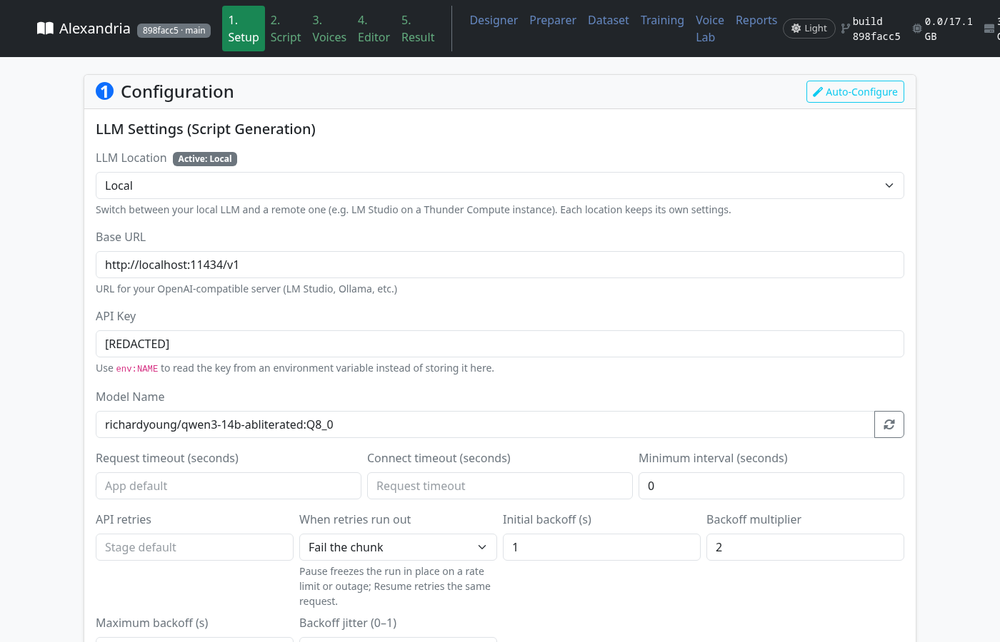
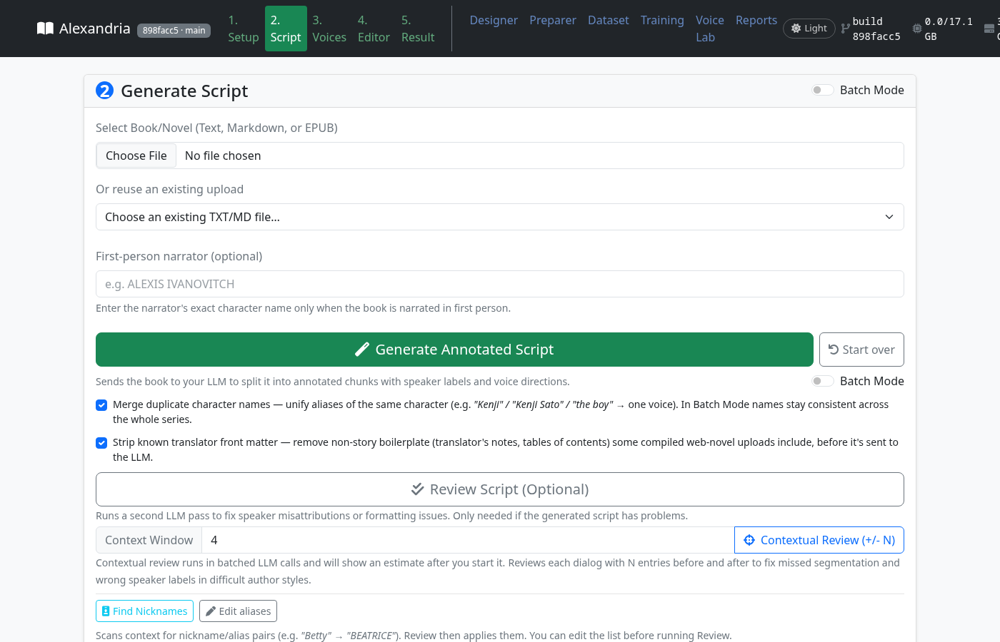
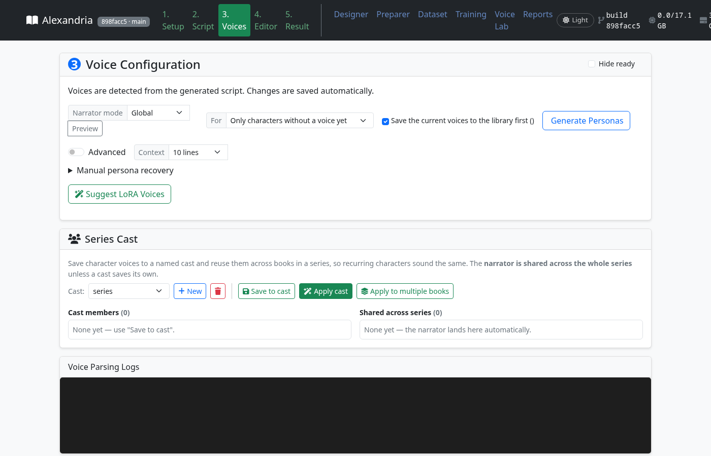
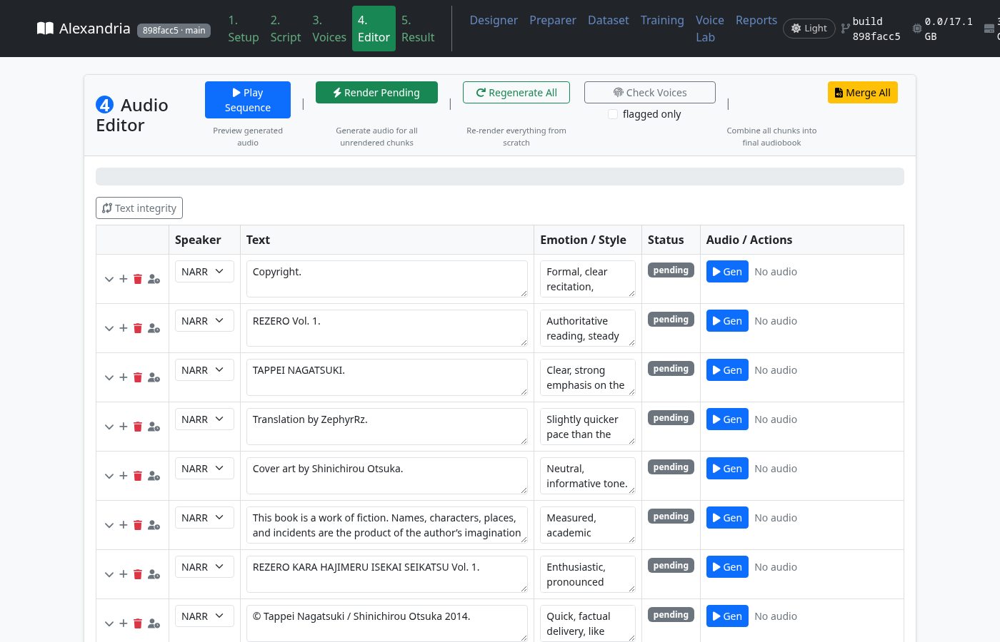
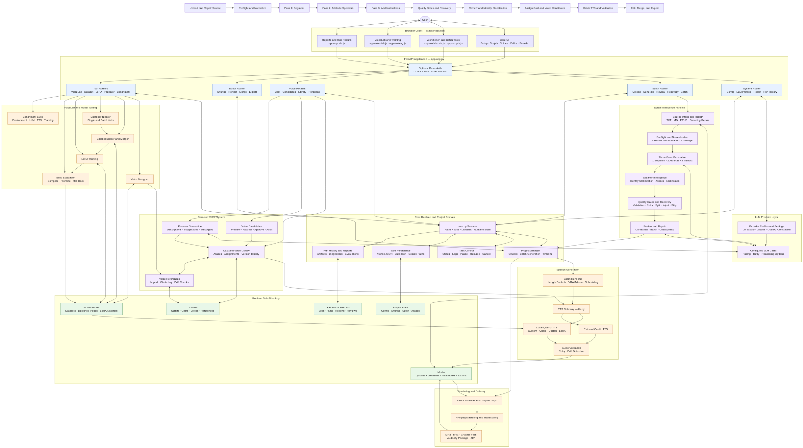

<p align="center">
  
</p>

# Alexandria Audiobook2

English | [中文](README_CN.md) · [Listen to a sample](https://github.com/user-attachments/files/25276110/sample.mp3)

Alexandria Audiobook2 turns a book into an audiobook with a different voice for
every character. You give it a `.txt`, `.md` or `.epub` file; a language model
works out who says each line and how it should sound; a text-to-speech model
reads it; and you get an MP3 or a chaptered M4B.

## Where to start

| I want to… | Start here |
|---|---|
| **Make an audiobook** | [Install](#installation), then follow [your first audiobook](#your-first-audiobook). |
| **Pick a model for my graphics card** | [Which model for your card](#which-model-for-your-card), then the [full guide](docs/wiki/Which-Model-For-Your-Card.md). |
| **Understand the research results** | [Results at a glance](#results-at-a-glance), then [RECIPES.md](RECIPES.md) and the [Muse quant comparison](docs/results/muse-quant-baselines.md). |
| **Find a particular run or its raw data** | Search the [results index](RESULTS_INDEX.md); each entry links to the committed artifact. |
| **Browse all documentation** | The [documentation map](docs/README.md) lists user guides, operations notes, results and history. |
| **Contribute** | The [project wiki](https://github.com/on22s/alexandria-audiobook2/wiki), then [Contributing](#contributing) and [GOALS.md](GOALS.md). |

You do not need to read any of the research sections to install or use the app.

## Research and development

It is a research fork of [Alexandria](https://github.com/Finrandojin/alexandria-audiobook).
What makes it different is that **every choice is measured**:

- which model and prompt pick the right speaker, scored against books where
  people have labelled every line;
- how close a generated voice gets to a real human reading;
- whether details like Japanese pitch accent survive synthesis.

The settings that won are the defaults, and every alternative stays selectable
in the Setup tab. For example, the `michel2_full` attribution prompt became the
default on 2026-09-19, once the last model family confirmed it was best. The
numbers, the failures and the recipes are all in this repository.

**Key documents**

- **[GOALS.md](GOALS.md)** — what "good" means for each goal, with the current measurement
- **[RECIPES.md](RECIPES.md)** — the training and serving settings that worked, each with the look-alike setting that failed
- **[RESULTS_INDEX.md](RESULTS_INDEX.md)** — every experiment artifact
- **[Adapters on Hugging Face](https://huggingface.co/Om22s/alexandria-qwen3-attribution)**, and **[HF_MODEL_GUIDE.md](HF_MODEL_GUIDE.md)** for how they are released

---

## Requirements

- **[Pinokio](https://pinokio.computer/)**, or Docker / Google Colab (see [Installation](#installation)).
- **A language-model (LLM) server** the app can reach through an OpenAI-compatible API.
  The app does not include one. Any of these works:
  - [llama.cpp](https://github.com/ggml-org/llama.cpp) `llama-server` — every number in
    this README was measured with it. It supports `--lora` for the attribution adapters
    and `--reasoning-budget` for reasoning models.
  - [LM Studio](https://lmstudio.ai/) or [Ollama](https://ollama.ai/).
  - A hosted API. DeepSeek v4-pro was measured; any OpenAI-style endpoint works.

  [Recommended LLM models](#recommended-llm-models) lists what each model size gets you.
- **A GPU for speech generation**: 8 GB of VRAM minimum, 16 GB recommended.
  - Each TTS model takes about 3.4 GB; the rest of the memory decides the batch size.
  - The LLM needs its own memory. A 16 GB card can hold a 9–13 GB language model
    *or* render audio. The app's GPU lock stops the two from colliding, unless you
    tell it the LLM runs somewhere else.
- **RAM**: 16 GB recommended.
- **Disk**: about 20 GB for the environment and TTS weights, plus your LLM files and audio.

### GPU compatibility

| GPU | OS | Speech (TTS) | Notes |
|-----|----|--------------|-------|
| **NVIDIA** | Windows / Linux | full | CUDA build via `torch.js` with flash attention; whisper.cpp built with CUDA for the Preparer |
| **AMD discrete** | Linux | full | ROCm; tested daily on an RX 9070 XT (RDNA4, ROCm 7.0). llama-cpp-python and whisper.cpp are built with HIP for your `gfx` target during install |
| **AMD APU / integrated** | Linux | full, slower | TTS runs in fp32 (bf16 is broken on the 660M/680M/780M class); everything else is the same |
| **AMD** | Windows | CPU only | ROCm is not available on Windows; use Linux for GPU |
| **Apple Silicon** | macOS | CPU only | Qwen3-TTS does not support MPS; whisper.cpp is built with Metal |
| **Intel** | macOS | CPU only | |

> **More documentation:** the upstream project's [wiki](https://github.com/Finrandojin/alexandria-audiobook/wiki)
> still explains voice types, LoRA training and batch generation well. Where this fork
> behaves differently, this README and `RECIPES.md` are correct.

## Installation

### Option A: Pinokio (recommended)

1. Install [Pinokio](https://pinokio.computer/).
2. In Pinokio, click **Download** and paste `https://github.com/on22s/alexandria-audiobook2`.
3. Click **Install**. This:
   - creates `app/env`;
   - installs the right version of torch for your machine (`torch.js`) and pins it,
     so no later step can swap it for a CPU-only build;
   - builds llama-cpp-python and whisper.cpp for your GPU.
4. Click **Start**, then **Open Web UI**.

Fresh Pinokio installations use CPython 3.10 for the prebuilt NVIDIA SageAttention/FlashAttention wheels. Existing environments are preserved; requesting those optional wheels from a different Python version stops before package installation with a compatibility error.

### Option B: Google Colab (no install)

[](https://colab.research.google.com/github/on22s/alexandria-audiobook2/blob/main/alexandria_colab.ipynb)

Runs the app on a free T4 GPU. You need a free [ngrok](https://dashboard.ngrok.com/signup)
account for the tunnel; the notebook walks you through it.

### Option C: Docker (NVIDIA)

```bash
git clone https://github.com/on22s/alexandria-audiobook2.git
cd alexandria-audiobook2
docker compose up --build
```

- Needs [Docker](https://docs.docker.com/get-docker/) with the
  [NVIDIA Container Toolkit](https://docs.nvidia.com/datacenter/cloud-native/container-toolkit/install-guide.html).
- The interface is at `http://localhost:4200`.
- TTS weights download into a volume the first time you render.
- Uploads, voice settings, adapters and audio are kept on disk through a bind mount.

> **Security:** Compose publishes the port on `127.0.0.1` only. The container itself
> binds `0.0.0.0`, because Docker needs that for forwarding. If you publish the host port
> on `0.0.0.0`, also set `ALEXANDRIA_AUTH_PASSWORD` — see
> [Authentication](#authentication-optional).

## First launch: what to expect

### 1. Start an LLM server first

Alexandria does not include a language model. Before you generate a script, one of these
must be running and reachable from the **Base URL** in the Setup tab.

- **llama.cpp** (recommended; the numbers here were measured with it):

  ```bash
  llama-server -m Qwen3-14B-Q4_K_M.gguf --host 127.0.0.1 --port 8090 \
    -ngl 99 -c 8192 --parallel 1 --flash-attn on \
    --reasoning on --reasoning-format deepseek --reasoning-budget 1024
  ```

  In Setup, use Base URL `http://127.0.0.1:8090/v1`, API key `local`, and as the model
  name whatever `--alias` says (or the file name).

- **LM Studio**: load a model, start its server, and use `http://localhost:1234/v1`.
  **Optimize LM Studio settings** applies the app's guarded, model-specific load settings;
  its local fallback is 8,192 tokens and one slot, not a universal 32k setting.

- **Ollama**: use `http://localhost:11434/v1` and the model name that `ollama list` shows.

- **A hosted API**: set **LLM Location** to *Remote*, paste the URL and key (or
  `env:DEEPSEEK_API_KEY` to read the key from an environment variable), and open
  **Provider request options**. Set **Runs on this machine's GPU?** to **No** so audio can render while the hosted model works.

The command is a starting configuration for a small first run, not a guarantee that every
request fits. Use your downloaded model's actual path. Context must hold the full prompt
(including roster and surrounding text) plus the response and any reasoning tokens. Larger
batches, review windows or custom prompts may need more; see
[choosing a context size](docs/wiki/Setup-and-Serving.md#choosing-a-context-size).
Attribution adapters are optional and must match their training prompt; leave them out of
the first run, then follow [Adapters](#adapters).

**Reasoning ("thinking") models work well — better, in fact.** Set **Reasoning effort**
to *low* and let the server cap the budget. Do not add `<think>` to the banned tokens.
Click **Test** in Setup to confirm the connection and see what the model answers.

### 2. The first speech generation downloads about 3.5 GB

The Qwen3-TTS weights (about 3.4 GB per variant: CustomVoice, and Base for
clone/design/LoRA voices) download the first time you render. Watch the Editor's log. A
download stuck at 0% is a network problem, not a frozen app.

### 3. The first batch is slower

The model has to load, and if **Compile Codec** is on, `torch.compile` takes another
30–60 seconds. The Editor's activity line tells you which one is happening.

### 4. GPU memory decides what can run at the same time

Speech needs about 3.4 GB plus room for batches, and an LLM on the same card needs its
own space. The GPU lock therefore refuses to start audio while script generation is using
the card — *unless* the active LLM profile is marked as not on this GPU (a hosted API or
a second machine). Then annotation and rendering can run together.

### 5. Where to look when something goes wrong

- The **activity line** under the Script tab's Generate button: what the run is waiting
  on, which attempt it is on, and how much time is left.
- `logs/api/<task>-latest.log` — the full log of every background task.
- `logs/review_responses.log` — every LLM request and reply during script generation and
  review, with the finish reason, token counts and time taken.
- `GET /api/status/eta` and `GET /api/status/<task>` for anything that is running.
- The **Reports** tab: run history with artifacts, and review checkpoints.

## Your first audiobook

Follow **Setup → Script → Voices → Editor → Result**. The screenshots show the existing
interface; labels may vary by build. First success means downloading an MP3 and listening
for missing lines and incorrect speakers.

### Before you start

- Start with a few paragraphs as `.txt`, `.md` or `.epub`, rather than a whole book.
  Save [this original two-character sample](docs/examples/first-book.txt) as a `.txt` file
  to try the complete flow without finding a book first.
- An LLM server running (see [the previous section](#1-start-an-llm-server-first)).
  A 9 GB Qwen3-14B model on a 16 GB card is enough for a good script;
  [Recommended LLM models](#recommended-llm-models) says what each size gets you.
- Time for the first model download and warm-up. Runtime depends on text length, model,
  hardware and settings; the Script tab estimates remaining time after it has made progress.

### Step 1 — Setup



1. Pick **LLM Location** (Local or Remote).
2. Fill in **Base URL**, **API Key** and **Model Name**. The refresh button lists the
   models the server offers.
3. For a reasoning model, set **Reasoning effort** to *low*.
4. Click **Test Connection**.
5. Leave the TTS section on `local` / `auto`. **Auto-Configure** fills in the TTS batch
   settings for your card.
6. Under **Prompt Settings**, the attribution prompt is already `michel2_full`, the project's
   measured default; model-specific exceptions are in the results below.
7. Click **Save Configuration**.

### Step 2 — Script



1. Choose the book, or reuse one you uploaded before.
2. If the novel is told in the first person, type that character's exact name.
3. Click **Test this book with the LLM** to sample the book first. A pass does not guarantee
   every later chunk will work. Then click **Generate Annotated Script**. The activity line shows the three steps as they
   run — *Step 1 (split) · unit 3 of 41 — asking the model*, then *Step 2 (speakers)*,
   then *Step 3 (delivery)* — with retries and, once it knows its speed, the time left.
   - You can **Pause**, **Save snapshot** (keep the finished part as a script),
     **Start over**, or later **Resume failed run**.
4. When it finishes, you can optionally:
   - run **Review Script** or **Contextual Review (+/- N)**;
   - run **Find Nicknames** and **Edit aliases**, so "Betty" and "BEATRICE" share a voice;
   - click **Save Current** to keep the script in your library.

### Step 3 — Voices



Every speaker gets a card, including the narrator. For the first run, assign a
**CustomVoice** preset to each card and preview it. This avoids needing a reference recording
or a trained adapter. Once that works, try the other options below.

For each character, either:

- choose a voice type yourself — **CustomVoice** (fastest), **Clone**, **LoRA**, or
  **Voice Design**; or
- click **Generate Personas**: the model describes each character, renders a reference
  voice, and assigns it as a clone voice.
  - By default this runs only for characters *without a voice yet*.
  - "Save the current voices to the library first" keeps what you already have.

Other tools on this tab:

- **Suggest LoRA Voices** matches trained voices to characters.
- A card's **style timeline** lets a voice change from a given line onward ("older after
  the time skip"), while the identity anchor keeps it recognisably the same person.
- **Save to cast** and **Apply cast** carry a cast of voices across a series.

### Step 4 — Editor



1. **Render Pending** renders every chunk in batches.
2. Listen, edit the text or the delivery instruction inline, and regenerate any single
   chunk.
3. Click **Check Voices** to run the drift check, then tick **flagged only** to see chunks
   whose audio drifted away from their speaker's voice.
4. Click **Merge All**.

### Step 5 — Result

- Play the audiobook and download the MP3.
- **Export chapters** with a filename template.
- **Export to Audacity** for one track per speaker.
- **Export M4B** with title, author, narrator, cover and chapter markers.

### If something goes wrong

The activity line names what the run is waiting on. Check `logs/api/<task>-latest.log`,
then see [Troubleshooting](#troubleshooting).

## Web interface

<details>
<summary>Expand the screen-by-screen guide to Setup, Script, Voices, Editor and the tools</summary>

The interface is a **five-step pipeline** (the numbered tabs) plus tools: Designer,
Preparer, Dataset, Training, Voice Lab and Reports. The header shows the commit of the
running build, GPU memory in use, and a light/dark toggle.

### 1 · Setup

**LLM Settings** — two profiles, *Local* and *Remote*, each remembered separately:

- **Base URL**, **API Key** (or `env:NAME`), **Model Name** (refresh lists the server's
  models). **Test Connection** shows the model's reply.
- **Request timeout**, **Connect timeout**, and **Minimum interval** between requests.
- **API retries** and **When retries run out** (fail the chunk, or pause the run), plus
  **Initial backoff**, **Backoff multiplier**, **Maximum backoff** and **Backoff jitter**.
- **Custom headers** and **Custom request body** (JSON) for providers that need them.
- **How requests are sent**: `http`, or `manual`. In manual mode the app writes each
  request to `manual_llm/pending.json`, and the Script tab shows a panel where you copy
  the prompt and paste the reply — you act as the model.
- **Runs on this machine's GPU?** — select **No** under **Provider request options**; then script generation and audio rendering may
  run at the same time.
- **Reasoning effort** — none / low / medium / high, sent to every LLM call in the format
  each provider expects.
- **Fail over to the other profile when this one gives up**.
- **Remote SSH host alias** — for a remote LM Studio that the app can inspect and
  optimise over SSH.

**TTS Settings**:

- **TTS Mode** (`local` / `external`), **TTS Server URL**, and **Server pool** (one URL
  per line, one locked client per configured worker), **External call timeout**.
- **Device** (`auto` / `cuda` / `cpu` / `mps`), **TTS Language**.
- **Parallel Workers**, **Batch Seed**, **Compile Codec**, **Optimize Batch Order**.
- **Sub-batching** with **Min Sub-batch Size** and **Length Ratio**; **Max Items/Batch**;
  **Max New Tokens**.
- **Speaker Change Pause** and **Same Speaker Pause** (milliseconds).

**Prompt Settings (Advanced)**:

- **Generation**: **Baseline Response Tokens**, **Temperature**, **Top P**, **Top K**,
  **Min P**, **Presence Penalty**, **Banned Tokens**, **Merge consecutive narrator lines**.
- **Three-pass**:
  - **Step 1: text per request** (default 3,000 characters);
  - **Step 1: dialogue detection** (Auto / Quote marks only / Model only);
  - **Segment output ratio**;
  - **Step 2: lines per request** (default 25);
  - **Step 2: extra text around each request** (default 2,000 — the `michel2_full`
    surrounding block; 0 reproduces the scores from before 2026-09-19);
  - per-pass **temperatures**, **Context rescue windows** and **Rescue retries per window**.
- **Attribution prompt** dropdown (each option starts with the variant name used in
  RECIPES), with the **System prompt**, **User instruction** (the pipeline fills in
  `{roster}` and `{batch}`) and **Worked example** as editable text.
  - **Save as preset** and **Delete selected**.
  - **What the model will see** shows the exact messages pass 2 would send.
  - **Reset to Defaults** reloads the `default_prompts_*.txt` files without a restart.
- **Review System Prompt** and **Review User Prompt Template**.
- **Optimize LM Studio settings** — pins the context length and parallel slots.

### 2 · Script

- **Select Book/Novel** (TXT, MD or EPUB — EPUB is converted on upload), or **reuse an
  existing upload**.
- **First-person narrator**.
- **Batch Mode** for several files: sort A→Z / Z→A / 1→10 / 10→1 / reverse, and choose
  what happens **When a saved script already exists**.
- **Generate Annotated Script**, **Start over**, **Pause**, **Save snapshot**, **Cancel**,
  **Resume failed run**.
  - Options: merge duplicate character names; strip known translator front matter.
- The activity line shows `Step N (name): unit i of N — asking the model`, retries by
  attempt, a **Plan:** line with the planned model calls, and
  `ETA: about X left (Step k of 3, d of t model calls done)`.
- **Review Script (Optional)**, **Contextual Review (+/- N)** with a **Context Window**,
  **Find Nicknames** and **Edit aliases**.
  - Batch review offers **Discover nicknames first** and **Two-pass (forward +
    backward)**, then **Start Batch Review**.
- **Saved Scripts** — **Save Current**, load, preview repairs for content and speakers,
  delete.
- The manual-transport panel — **Copy prompt**, paste the reply, **Submit reply**.

### 3 · Voices

- One card per speaker, with the voice type, a preview, and the **Alias of** dropdown.
  **Hide ready** hides characters that already have a voice.
- **Generate Personas**, with:
  - the scope selector (only characters without a voice, or all characters);
  - **Save the current voices to the library first**;
  - an **Advanced** batch size.
- **Suggest LoRA Voices**; the candidates can be accepted with **Apply all** or rejected
  with **Dismiss**.
- **Validate & save** / **Validate & resume** for a paused persona run.
- **Style timeline** per speaker — change points from a given line, each with a new
  character style, on top of the constant identity anchor.
- **Series Cast** — **New**, **Save to cast**, **Apply cast**, **Apply to multiple books**.

### 4 · Editor

- Toolbar: **Play Sequence**, **Render Pending**, **Regenerate All**, **Cancel**,
  **Check Voices** (drift check), **flagged only**, **Text integrity**, **Merge All**.
- Each chunk: play; edit the speaker, text or instruction; regenerate; insert; delete.
- Render modes:
  - **Render Pending** renders only what is missing, in sub-batches;
  - **Regenerate All** re-renders everything.
  - Both respect the GPU lock.

### 5 · Result

- Your audiobook, with play and download.
- **Export to Audacity**.
- **Export M4B**: **Title**, **Author**, **Narrator**, **Year**, **Description**,
  **Cover Image**, **Per-chunk chapters**.
- **Export chapters**: **Filename template**, **Number padding**, **Format**, **Book
  name**, **Series name**, **Volume**, **Chapters (optional)**, **Per-chunk**,
  **Changed only**, **Require ready**, **Preview names**, and presets.
- **Cancel Merge**.

### Designer

**Voice Description**, **Sample Text**, **Generate Preview**, **Voice Name**, **Save
Voice**. Saved voices appear as clone references in the Voices tab and can be edited in
place.

### Preparer

Turns an audiobook into aligned (audio, text) pairs for training a voice.

- **Select Audio File**, or **Batch Mode** for several.
- **Source Text** (EPUB/TXT), **Source Threshold**, **Keep unaligned chunks**,
  **Source Start Word / Text**, **Disable auto-anchor**.
- **Chunk Size**, **Min Chunk Duration**, **Resume from dataset_temp/**.
- **LLM enrichment** — speaker attribution, narration style and emotional tone, using an
  **Enrichment LLM Model Path**.
- **Language**, **Confidence**, **Min SNR**, **Speaker Diarization** (needs a **Hugging
  Face Token**).

See [PREPARER_GUIDE.md](docs/guides/PREPARER_GUIDE.md).

### Dataset

**New Dataset**, **Add Row**, **Generate Pending** / **Regen All** (renders each row with
the **Root Voice Description**, **Global Seed** and a reference sample), **Import /
Export JSON**, **Save as Training Dataset**.

### Training

- **Upload ZIP** or **Build New Dataset**.
- **Adapter Name**, **Dataset**, **Epochs**, **Learning Rate**, **Batch Size**, **LoRA
  Rank**, **LoRA Alpha**, **Grad Accum Steps**, **Language**; then **Start Training**.
- Trained adapters are listed with a test **Generate** (**Adapter**, **Text**,
  **Instruct**), comparison and blind-review views, and promotion with a rollback receipt.

### Voice Lab

The whole-library pipeline:

- **Input folder** (one subfolder per narrator) and **EPUB search folders**.
- Stages:
  - **Quality** — a warning-only audit of clip health and duplicates;
  - **Train** — one LoRA per deduplicated voice, with **Target loss**, **Max epochs**
    and **LoRA rank**;
  - **Profile** — acoustic and LLM voice descriptions, with a **Profiler model**;
  - **Name** — a descriptive slug, with a dry-run preview before renaming.
- **Inspect**, **Run Pipeline**, **Pause**, **Cancel**, and copy/download of diagnostics.

See [lora.md](docs/guides/lora.md) and [BATCH_PROCESSOR_GUIDE.md](docs/guides/BATCH_PROCESSOR_GUIDE.md).

### Reports

- **Runs** — history with artifacts.
- **Review Checkpoints**.
- **Reports** — rendered views.
- **Benchmark** — **Preflight** / **Start** / **Cancel** a manifest (`stage`, `targets`,
  `fixtures`, `settings`) for the environment, LLM, TTS and training benchmarks.

</details>

## Screenshots

| | |
|---|---|
|  |  |
|  |  |

---

## Features

### Understanding the book (script intelligence)

- **Any OpenAI-compatible LLM** — llama.cpp (the measured setup), LM Studio, Ollama, or
  DeepSeek/OpenAI-style APIs, with two saved profiles and automatic failover between them.
- **Three passes over the text**:
  1. split the text into narration and spoken lines (by quote marks or by the model);
  2. give each spoken line a speaker from the book's cast list, using the surrounding text;
  3. write a delivery instruction for every line.

  Each pass has its own temperature and request size.
- **Measured prompt variants** — choose the attribution prompt in Setup. The dropdown uses
  the same names as RECIPES, and the text is editable.
- **Review pass** — a second LLM pass that:
  - removes attribution tags ("she said") from dialogue;
  - splits narration that was wrongly given to a character;
  - merges narrator lines that were split too finely;
  - checks the delivery instructions.

  It can look at ±N neighbouring lines, and can run across a whole series with nickname
  discovery and a two-pass (forward, then backward) option.
- **Consistent characters** — merges duplicate character names, remembers every alias a
  character has been called, handles first-person narrators, strips translators' front
  matter, and repairs garbled text encodings.
- **Recovery** — a checkpoint after every pass, resume after a power cut, pause instead of
  failing when API retries run out, save the finished part as a snapshot, and start over
  without losing your settings.

### Voices

- **Built-in Qwen3-TTS** — no separate server needed; a pool of external Gradio servers
  is also supported for CustomVoice and Clone. Voice Design and LoRA require
  local TTS mode; external mode reports an unsupported-voice error before model loading.
- **Four voice types**:
  - **CustomVoice** — 9 presets that follow delivery instructions;
  - **Clone** — from a 5–15 second reference, with its rights recorded on import;
  - **Voice Design** — from a text description;
  - **LoRA** — trained voices, with presets included.
- **Identity anchor and style timeline** — a fixed description per speaker that delivery
  instructions cannot override, plus change points where a character should sound
  different from a given line onward.
- **Persona generation** — the LLM describes each character, Voice Design renders a
  reference, and a clone voice is assigned. By default it only fills in missing voices.
- **Batch rendering** — sub-batches grouped by length, scheduling that respects GPU
  memory, and optional `torch.compile` for the codec. 3–6× faster than real time on a
  mid-range card.
- **Drift check** — rendered chunks are compared with their speaker's reference and
  flagged if they wandered.
- **Ten languages** — English, Chinese, French, German, Italian, Japanese, Korean,
  Portuguese, Russian, Spanish, or auto-detect.

### Editing and export

- **Chunk editor** with selective regeneration, a filter for drifted chunks, and
  sequence playback.
- **Natural pauses** between and within speakers, and **dead-air trimming** when chunks
  are joined.
- **Combined MP3 (128 kbps)**, per-line voice files, **chapter export** with filename
  templates, a multi-track **Audacity** package, and **M4B** with chapters.

### Voice Lab and tools

- **Preparer** — an audiobook plus its EPUB/TXT become aligned (audio, text) pairs, with
  optional LLM enrichment (speaker, narration style, emotional tone).
- **Dataset Builder** and **LoRA Training** tabs for one voice; batch training,
  deduplication, profiling and naming for a whole library.
- **Blind evaluation** of voice adapters — compare, promote, and roll back with a receipt.
- **Reports** — run history, review checkpoints and benchmark manifests.

### What this fork adds to upstream Alexandria

In the order you meet them in the app:

- **Three-pass script generation** (split, attribute, instruct). The text per request,
  lines per request and surrounding context of each pass are all set in Setup; each
  pass is checkpointed, resumable and pausable.
- **Attribution prompt variants** in Setup (`default`, `michel`, `michel2`,
  `michel2_full`, `michel2_shot`). Each was measured on the same labelled books, and the
  prompt text you see is exactly what is sent; you can edit it and save it as a preset.
- **First-class reasoning models**:
  - a reasoning-effort setting reaches every LLM call;
  - every request carries a JSON schema;
  - reasoning tokens are counted from the trace when the server does not report them;
  - the retry limit follows the configured token budget.

  You no longer need to ban `<think>`.
- **LLM profiles** — a local and a remote profile, each with its own URL, key (or
  `env:NAME`), model, timeouts, retry/backoff policy, custom headers and request body.
  - Failover to the other profile when one gives up.
  - A flag for whether the LLM uses this machine's GPU, so audio can render while a
    hosted model annotates.
  - A **manual transport** where you are the model: the app writes each request to a
    file and waits for your reply.
- **Pass-1 dialogue detection**: Auto / Quote marks only / Model only.
- **Script tab progress**: an activity line saying what the run is waiting on, retries by
  attempt, and a time-left estimate from the pipeline itself; plus Start over, Save
  snapshot, and a Pause button that is greyed out on Windows instead of failing on every
  click.
- **Voices**:
  - generate personas or suggest LoRA voices for *only the characters without a voice
    yet*, saving the current voices to the library first;
  - a per-speaker **identity anchor** so delivery instructions cannot change the voice's
    character, with **change points** ("from this line, this character sounds older");
  - series casts and a voice library;
  - nickname discovery;
  - clone-reference imports with their transcript, source and rights basis recorded.
- **Editor**: chunks are flagged when their audio drifted from the speaker's voice;
  dead air is trimmed when chunks are joined.
- **Export**: 128 kbps MP3, chapter-by-chapter export with filename templates, an
  Audacity package, and chaptered M4B.
- **Voice Lab**: an audiobook in, a named LoRA voice out — Preparer (alignment plus
  optional LLM enrichment) → dedup → batch LoRA training → profiling → naming, every
  stage inside the app's own environment.
- **Reports tab**: run history, review checkpoints, and the benchmark harness
  (environment · LLM · TTS · training) with a manifest.
- **Attribution adapters** served through `llama-server --lora`, trained on rights-clean
  data, and released on Hugging Face with cards that say what was and was not measured.
- **Measurement discipline**: `GOALS.md`, `RECIPES.md`, a results index that is rebuilt
  rather than merged, provenance on every artifact, a release verifier, and about 3,400
  unit tests.

## How it works



The strip along the top is the path a book takes:

1. upload and repair the source;
2. preflight checks and normalisation;
3. **pass 1 — split** into narration and dialogue;
4. **pass 2 — attribute** each line to a speaker;
5. **pass 3 — add delivery instructions**;
6. quality gates and recovery;
7. review, and keeping each character's identity stable;
8. assign a cast and voice candidates;
9. batch speech generation and validation;
10. edit, merge and export.

The boxes below the strip are the code that does each step. The editable source is
[`docs/architecture.drawio.svg`](docs/architecture.drawio.svg).

---

## Results at a glance

Every number here comes from a fixed test set with a paired control, and names that test
set. They are benchmark results, not guarantees about your book. The full history of
earlier tables is in [docs/results/attribution-history.md](docs/results/attribution-history.md).

The two test sets used most:

- **Four-book fixture** — 768 dialogue lines from four translated Japanese light novels,
  each labelled with its speaker, scored through the app's own three-pass pipeline at
  temperature 0 with a JSON schema.
- **Nine-novel PDNC panel** — 2,655 lines from nine public-domain English novels in the
  Project Dialogism Novel Corpus, 40 windows per novel.

### Who says which line — attribution accuracy

The shape of the prompt is the biggest single improvement this project found. The
`michel2_full` variant (after Michel et al.; it adds a block of about 2,000 characters of
surrounding text to each request) wins on every model measured. Base models, no adapter,
reasoning low, four-book fixture (RECIPES §"Prompt variants × bases", 2026-09-18):

| model | file | `default` prompt | `michel2_full` | notes |
|---|---:|---:|---:|---|
| DeepSeek v4-pro (API, thinking off) | — | 91.1 | **94.9** | thinking low (8k): **95.4** — the cloud ceiling; about $0.50–0.75 per run of the fixture |
| Qwen3.8-27B UD-Q4_K_M | 16.5 GB | 82.9 | 89.8 | `michel2` **90.9** — the best local result |
| Qwen3.6-35B-A3B UD-Q4_K_XL | 22.4 GB | — | **89.6** | IQ3_XXS (13.2 GB) and IQ2_XXS (10.8 GB) score 91.6 / 90.5 on the nine novels |
| Muse-Glimmer-30B UD-Q3_K_XL | 13.4 GB | 81.5 | **90.5** | the shipped base; `michel2` 86.6; without reasoning 72.1 |
| Qwen3-14B Q4_K_M | 9.0 GB | 66.1 | **82.0** | +16 from the prompt alone, the largest gain of any model |
| Qwen3.5-9B / Qwen3-8B Q4_K_M | 5–6 GB | 62.6 / 60.8 | **74.9 / 77.0** | post-#616 prompt; both collapse on the hardest book |

Other reference points:

- **Muse quant comparison** (nine novels, base only): **93.33%** at Q3 and **94.61%** at
  Q4 — [full comparison](docs/results/muse-quant-baselines.md).
- **DeepSeek v4-pro** on the nine novels: **98.0%** (96.7% before the 2026-09-28 rescore), answering every line.
- **Nemotron 3 Ultra** (paid OpenRouter, base only, per book): 96.7% *Mansfield Park*,
  97.6% *Northanger Abbey*, 97.1% *Persuasion*, 85.3% *The Sign of the Four*, 87.3%
  *The Sun Also Rises*. These are single-book API baselines, not a pooled score; the
  provider-routing caveat is in
  [RECIPES.md](RECIPES.md#september-22-follow-up-low-quant-adapter-and-nemotron-api-baselines).

**Local vs cloud** (goal 4.2 — the best local model as a share of DeepSeek's score):

- Four-book fixture: **97.3% / 97.5% / 94.5% / 92.9%** per book. Two books are outside
  the 5% band the goal asks for.
- All 28 PDNC novels: the best local model, Qwen3.8-27B UD-Q3_K_XL, is within 5% on
  **20 of 28** books. The misses are being re-measured at 40 windows per book.

### Which model for your card

Nine novels, 2,655 lines, `michel2_full`, reasoning low. The full ladder and the
reasoning behind it: [Which model for your card](docs/wiki/Which-Model-For-Your-Card.md).

| your card | typical cards | run this | file | base accuracy | load the adapter? |
|---|---|---|---:|---:|---|
| 32 / 24 / 16 GB | RTX 5090, 4090, 3090, 5080, 5070 Ti, RX 9070 XT | Qwen3.8-27B UD-Q3_K_XL | 12.5 GB | **95.2%** | **yes** — +1.0 on the novels it never trained on (p=0.004) |
| 12 GB | RTX 5070, Arc B580 | Qwen3.8-27B Q2_K_XL | 9.4 GB | **93.7%** | no — no gain at this quant |
| 8 GB | RX 9060 XT 8 GB, RTX 5060 | Qwen3.8-27B UD-IQ2_XXS | 6.9 GB | 88.7% | **yes** — +1.3 (p=0.045) |
| 6 GB | GTX 1660, RTX 2060, laptops | Qwen3-8B Q4_K_M | 4.7 GB | **77.0%** *(four-book)* | **yes** — +5.3 four-book, +6.2 on the nine novels |
| no usable GPU | — | a hosted model, or the manual transport | — | **94.9–95.4%** *(four-book)* | n/a |

What the measurements say about choosing:

- **16 GB is the sweet spot; more memory does not help.** A 5090 runs the same 12.5 GB
  file to the same 95.2%.
- **Q3_K_XL beats Q4_K_M on Qwen3.8** (95.2 vs 94.9) for 3 GB less, so don't pay for Q4.
- **A small quant of a big model beats a big quant of a small model.** Qwen3.8-27B at
  IQ2_XXS (6.9 GB) scores 88.7%; Qwen3-14B at Q4_K_M (9.0 GB) scores 84.3%.
- **Context length, not file size, decides whether a model fits.** The same 5.4 GB model
  was reported at 5.1 GB with `-c 4096` and 11.3 GB with `-c 32768`. These are
  model-specific measurements, not a sizing rule. See the
  [context-size guide](docs/wiki/Setup-and-Serving.md#choosing-a-context-size) for workload
  and response-budget limits; 8k is not enough for every request.
- **If speed matters more than the last few points**, Qwen3.6-35B-A3B runs about as fast
  as an 8B model (about 20 s per window) while scoring about 11 points higher; see the
  [speed table](docs/wiki/Which-Model-For-Your-Card.md).

### Adapters

LoRA adapters for the attribution task, trained only on rights-clean data: public-domain
PDNC novels, RiQuA, and public-domain (CC0) play scripts rendered as prose. There is no
light-novel text in them. They are public on the Hub:
[Om22s/alexandria-qwen3-attribution](https://huggingface.co/Om22s/alexandria-qwen3-attribution).
How to load one: [ATTRIBUTION_ADAPTER_SETUP.md](docs/guides/ATTRIBUTION_ADAPTER_SETUP.md).

**An adapter helps most when the base model is struggling.** Measured across four model
families:

- Below about 35% base accuracy, an adapter is worth **+57 to +62 points** — it restores
  the model's ability to answer at all (Muse IQ2_XXS, on two vendors' GPUs).
- Between 85% and 90%, it is worth **+1 to +4**, often not significant.
- **Above about 90%, it moves by a point or two either way — measure it on its own prompt.**
  The A3B window25 adapter costs 2.1 at Q4_K_XL; the Muse window25b adapter gains 1.1 at Q4_K_M
  on its training prompt (the −1.1 once quoted came from serving it on older prompt text).

So load one where the base is visibly failing (blank replies, malformed JSON, wrong
numbers of entries), not to chase a few points on a model that already works.

Current verdicts, nine held-out novels unless noted (after the 2026-09-28 rescore —
RECIPES §"Rescored 2026-09-28"):

| adapter | where to load it | measured gain |
|---|---|---|
| Qwen3-8B window25 (`michel2v2`) | Q4_K_M and Q3_K_XL | **+6.2** (Q4_K_M), **+9.0** (Q3_K_XL) |
| Qwen3.8-27B (`michel2v1`) | Q4_K_M, Q3_K_XL, IQ2_XXS — not Q2_K_XL | **+1.0 to +1.3** on the eight novels it did not train on |
| Qwen3.6-35B-A3B window25 (`michel2v2`) | **IQ1_M only** | +1.5 at IQ1_M; flat at IQ2_XXS/IQ3_XXS; **−2.1 at Q4_K_XL** |
| Muse-Glimmer-30B window25 | IQ2_XXS, where the base cannot keep the JSON format | **+61.9** (four-book); flat at IQ3; −1.0 at Q4_K_M |
| Qwen3-14B rights-clean (`attrv1`) | only with the `default` prompt | +8.6 four-book under `default`; no gain under `michel2_full` |

- An adapter belongs to the prompt it was trained on: serve `attrv1` adapters with
  `default`, and `michel2` adapters with `michel2_full`.
- Always quote the test set: the Muse window25 adapter's +4.3 on the four-book IQ3 cells
  does **not** replicate on the nine novels (+0.3, p=0.489).

### Voices — measured against a human reading

| goal | measure | result |
|---|---|---|
| 2.1 speaker similarity | ECAPA cosine between the generated voice and the human reading, as a % of the same narrator's own consistency | English clone 93% (LJSpeech) / 86% (a second reader); Japanese 98%; Chinese blocked until goal 2.2's anchor repair is re-measured. Target 95%. |
| 2.8 a voice stays the same voice | semitone drift of a CustomVoice narrator over 120 lines, against an anchor of its first lines | instructions as written **3.49 st**; with a per-speaker identity anchor **2.53 st** (ECAPA 0.737 → 0.771). A full-book run is queued. |
| 2.9 pitch-carried meaning | Japanese accent-nucleus high→low drop realised, morae aligned with CTC | human readers 72.6%, clone 74.4%, LoRA 71.2% — synthesis matches the human rate |
| dead air | leading silence on LoRA-voice lines | median 310–340 ms, 4–5% of a book; trimmed when chunks are joined (−45 dBFS, 40/80 ms kept) |
| pass 1 dialogue detection | quote-mark splitter on all 28 PDNC novels | 99.84% span recall, 94.89% precision — no model call needed to split quoted English |

Goals met and kept in place by a test (GOALS Part II): the selection gap is closed, every
generated file is real audio, one character has one voice, output is reproducible,
generation is faster than real time, nothing unspeakable reaches the TTS, foreign words
are said as foreign words, and the measurement-integrity rules 6.1–6.4 hold.

---

## Recommended LLM models

Every row is measured on the four-book fixture (768 lines) with the app's pipeline at
temperature 0 and a JSON schema, and with reasoning low (1,024-token budget) where the
model reasons (RECIPES §"Prompt variants × bases", 2026-09-18). "Best variant" is the
attribution prompt to pick in Setup.

| model | file size | card it fits (file + context) | best variant | score | good for |
|---|---|---:|---|---:|---|
| DeepSeek v4-pro (hosted API) | — | none | `michel2_full`, thinking low 8k | **95.4** | the ceiling; about $0.50–0.75 for a fixture-sized book |
| Qwen3.8-27B UD-Q4_K_M | 16.5 GB | 24 GB | `michel2` | **90.9** | the best local model; the worked example (`michel2_shot`) gives the best score on the hardest book (94.4) |
| Qwen3.6-35B-A3B UD-Q4_K_XL / IQ3_XXS / IQ2_XXS | 22.4 / 13.2 / 10.8 GB | 24 / 16 / 16 GB | `michel2_full` | 89.6 four-book; 91.6 / 90.5 nine-novel at IQ3 / IQ2 | speed: fits a 16 GB card at IQ3 or IQ2 (with `--n-cpu-moe` offloading some experts) and stays within a point of Q4 |
| Muse-Glimmer-30B UD-Q3_K_XL | 13.4 GB | 16 GB | `michel2_full` | **90.5** | strong, but serve it with reasoning on and the deepseek reasoning format, and never with `--skip-chat-parsing` |
| Qwen3-14B Q4_K_M | 9.0 GB | 12 GB | `michel2_full` | 82.0 | +16 from the prompt; the rights-clean adapter adds +8.6 on top under the `default` prompt |
| Qwen3.5-9B / Qwen3-8B Q4_K_M | 5–6 GB | 8 GB | `michel2_full` | ~72 | the 8 GB option; both collapse on the hardest book (47 / 62) |

Rules that held on every model:

- `michel2_full` ≥ `michel2` ≥ `michel` ≥ `default`. The one exception is Qwen3.8, where
  `michel2` beats `michel2_full` by a point. The surrounding-text block is the biggest
  single step.
- The worked example (`michel2_shot`) never helps, except on Qwen3.8.
- **An adapter trained on one prompt loses under another.** Serve the rights-clean
  Qwen3-14B adapter with `default`, and the `michel2` adapters with `michel2_full`.
- Reasoning low with a server-side budget beats reasoning off on every model that
  reasons. Medium and high budgets were no better (+8.1 / +8.6 / +8.8 at 512 / 1024 /
  2048 tokens for the adapter cell). Don't ban `<think>`.
- Temperature 0 is deterministic on an idle GPU: a repeat run gives the same answer on
  every line. Any "noise" you see comes from another job sharing the card.

## Performance

Measured one job at a time under the GPU lock, on an RX 9070 XT (16 GB, ROCm), unless
stated otherwise:

| work | rate |
|---|---|
| batch speech rendering, CustomVoice | 3–6× real time |
| LoRA voice retrain, one adapter (200 clips) | about 5.4 min |
| identity gate, one adapter | 2.0–2.7 min |
| three-pass attribution of a 40-window novel slice, local A3B IQ2/IQ3 at reasoning low | about 30–50 min per novel |
| Qwen3-14B Q4_K_M in llama.cpp, fully on the card | about 32 tokens/s |
| full unit-test suite (CPU) | about 20 s |

**Batch settings:** raise Parallel Workers as far as memory allows, Sub-batching on, and
Compile Codec on for long books (30–60 s warm-up, then 3–4× faster decoding). Measured on the
RX 9070 XT (48 lines, CustomVoice, production batch path, codec not compiled), speed was still
rising at 16:

| Parallel Workers | 1 | 2 | 4 | 8 | 16 |
|---|---|---|---|---|---|
| × real time | 1.20 | 1.56 | 2.24 | 2.78 | 3.93 |
| peak VRAM (torch) | 4.6 GB | 5.1 GB | 5.9 GB | 5.7 GB | 6.8 GB |

The **Auto-Configure** button sets these from your card's memory.

**ROCm notes:**

- The app applies RDNA-specific settings itself (`device_utils.enable_rocm_optimizations`).
- AMD APUs run speech in fp32.
- For the LLM, ROCm is about 11% faster than Vulkan on RDNA4, and KV-cache quantisation
  is what lets a 27B model fit next to the TTS on 16 GB.
- **Never install the PyPI `llama-cpp-python` wheel over the HIP build the installer
  makes.** It is CPU-only and silently replaces the GPU build.

## Script format

An annotated script is a JSON array. Each entry is one line the TTS will speak:

```json
[
  {"speaker": "NARRATOR", "text": "The rain had not stopped for three days.", "instruct": "Low, steady, unhurried."},
  {"speaker": "MARA", "text": "We should turn back.", "instruct": "Tense, quiet, near a whisper."},
  {"speaker": "TOMAS", "text": "Not yet.", "instruct": "Flat, resolved."}
]
```

- **`speaker`** is `NARRATOR` or an uppercase character name from the cast list.
  `UNKNOWN` means the model could not tell; the review pass and aliases clean these up.
- **`text`** is exactly what is spoken.
  - Attribution tags ("she said") are narration, not dialogue.
  - Quote marks are dropped: the speaker field records that a line is speech, not the
    punctuation.
- **`instruct`** is the delivery direction written by pass 3. The Voices tab's identity
  anchor is added at render time, so an instruction cannot change who the voice is.

### Non-verbal sounds

Pass 3 writes sounds as pronounceable text ("Ahh!", "Mmm…", "Haha!") with a matching
instruction, and the TTS speaks them. Nothing unspeakable — bare tags, pictographic kana —
reaches the speech engine (goal 5.1).

## Output files

Everything is stored under the app directory (or `ALEXANDRIA_DATA_DIR` if set):

| path | contents |
|---|---|
| `uploads/` | the books you uploaded (reusable) |
| `annotated_script.json`, `voice_config.json`, `character_aliases.json` | the active book, its voices and its aliases |
| `scripts/<name>.json` + `<name>.voice_config.json` | the saved-script library |
| `voice_library.json` | casts |
| `chunks.json` | the render state of the active book |
| `voicelines/` | one WAV/MP3 per chunk |
| `cloned_audiobook.mp3` | the merged audiobook (128 kbps) |
| `audiobook.m4b` | the chaptered M4B |
| `chapter_exports/` | chapter files from the template exporter, plus a zip |
| `manual_llm/pending.json` / `response.json` | the manual-transport mailbox |
| `lora_models/`, `lora_datasets/`, `designed_voices/`, `clone_voices/`, `builtin_lora/` | model assets (built-in adapters ship read-only in the repo) |
| `logs/api/`, `logs/review_responses.log`, `reports/` | operational records; run history is served by `/api/runs` |
| `ab_test_runtime/experiments/` | every measurement artifact, indexed in `RESULTS_INDEX.md` |

## Prompt customization

Each of the three passes reads a prompt file in `app/`:

- `default_prompts_segment.txt`, `default_prompts_attribute.txt`,
  `default_prompts_instruct.txt` — each is a system message, then `---SEPARATOR---`,
  then a user message with `{roster}` and `{batch}` placeholders.
- The review pass uses `review_prompts.txt`.

How to change them:

- **Variants** — `app/attribution_prompt_variants.py` defines how each attribution variant
  reshapes the request (the `michel2_full` surrounding block, the `michel2_shot` worked
  example, and so on). The Setup dropdown selects one, and the text shown is what will be
  sent.
- **Presets** — edit the text in Setup and click **Save as preset**. Presets are stored in
  `config.json` and survive restarts. **Reset to Defaults** reloads the files without a
  restart.
- **What the model will see** — shows the exact system and user messages pass 2 would
  send with the current settings (`POST /api/prompts/attribution_preview`).
- **Changing the prompt changes the measurement.** A score in RECIPES belongs to its
  variant, and an adapter belongs to the prompt it was trained on.

## Troubleshooting

### Pinokio does not reach "Open Web UI"

`start.js` waits for Alexandria to print its web address. Import errors, port conflicts,
Python tracebacks and FastAPI startup failures now stop the launcher visibly, instead of
leaving the sidebar stuck on **Starting**.

1. Open **Terminal** next to the running or failed Start entry and read the first
   traceback or startup error. The navbar build label shows which revision is actually
   running; hover over it for the Python and package versions.
2. Open Pinokio's **Logs** page and select the latest Alexandria session. Its **Get
   Help** report bundles the related launcher logs and system details, with Pinokio's
   usual redaction of secrets and paths, ready to share.
3. To read the files directly:
   - the current launcher log is `logs/api/start.js/latest`, with timestamped runs beside it;
   - `logs/sessions/` groups related install, start and helper runs;
   - app task logs (script generation, review, audio) are in `logs/api/*-latest.log`.
4. Fix the first startup error, then stop and start the existing `start.js` entry. Do not
   launch a second copy to get around an "address already in use" error.
   - `env_doctor.py` reports the two most common causes: a missing `app/env`, or a torch
     that a later install replaced with a CPU-only build.

The launcher picks a free port through Pinokio and binds Alexandria to `127.0.0.1`; you
do not need to set a port.

### Script generation says "Idle" for a long time

Read the activity line under Generate. It names the step, the unit, the attempt, and what
it is waiting on (the model, a rate-limit backoff, a retry).

- If it has said nothing for minutes, the LLM server has stopped answering — test it
  from Setup.
- A run paused by "When retries run out → pause" waits for you to click Resume.

### Pause is greyed out

On Windows the app cannot suspend the worker process, so Pause is disabled instead of
failing on every click. Cancel and Resume failed run still work.

### Script generation fails

- **The model answered outside the JSON format.** Pick a model from the
  [recommended table](#recommended-llm-models), keep the schema on, and set reasoning to
  low. `logs/review_responses.log` shows the exact reply.
- **Context length.** Check the server error and prompt/output token counts. If the complete
  request exceeds the loaded context, reduce request size or choose a larger context that
  fits your model and VRAM. 8k is not inherently faulty, and 32k is not always safe; see
  [context sizing](docs/wiki/Setup-and-Serving.md#choosing-a-context-size).
- **No API at all.** Set **How requests are sent** to `manual` and answer the prompts
  yourself from the Script tab panel.

### Model download fails or is slow

The TTS weights come from Hugging Face on the first render. A proxy or a half-finished
download shows up as a stall at 0%. Delete the partial file in the Hugging Face cache and
try again; `download_model.py` fetches the weights outside the app.

### Speech generation fails

- Check `logs/api/audio-latest.log` — the first traceback is the real one.
- AMD APU: the app uses fp32 automatically; if you forced `bf16`, remove it.
- A merged voice adapter that "stops talking" (goal 2.3) is a defect in the trained voice.
  The identity gate catches it before promotion; use a shipped preset for that character
  meanwhile.

### Batch generation is slow

- Turn Compile Codec and Sub-batching on, and raise Parallel Workers as far as your GPU
  memory allows. The first batch includes model loading and compile warm-up.
- An LLM on the same card halves what the TTS can use. If you use a hosted LLM, mark it as
  not on this GPU.

### Out of memory

Lower Parallel Workers and Max Items/Batch. The memory check refuses to start a batch it
cannot fit, so an out-of-memory error in the middle of a run usually means another
process took the card after the check.

### Broken or tiny MP3 files (428 bytes)

ffmpeg is missing or not on the PATH. The installer builds it into the environment, so a
428-byte file means the app is running outside `app/env`. Every generated file is checked
(goal 3.2), and the Editor flags the chunk.

### Audio quality

- Clone references shorter than about 7 seconds make an unstable voice (a finding from
  goal 2.2); the import check now normalises and measures them.
- Instructions that describe the voice itself ("deep", "raspy") fight the chosen voice.
  The identity anchor removes those words; an audit found them in 1–4% of instructions.

### Garbled or missing characters in the text

Source repair on upload fixes common encoding problems. For a book that still shows `’`,
run the repair preview from Saved Scripts. Pictographic kana and other unspeakable
characters are deliberately removed before the TTS (goal 5.1).

## API reference

<details>
<summary>Advanced: HTTP examples, authentication, and the full 181-route reference</summary>

Every action in the interface is an HTTP call. The route tables below are generated from
the route decorators in `app/routers/` (181 routes).

### Authentication (optional)

By default the app has **no authentication** and binds to `127.0.0.1`. If you expose it
beyond your own machine — Docker binds `0.0.0.0`, or you use a tunnel or reverse proxy —
turn on HTTP Basic Auth:

```bash
export ALEXANDRIA_AUTH_PASSWORD=your-secret       # turns the password check on
export ALEXANDRIA_AUTH_USERNAME=alexandria        # optional
```

Every request must then carry the credentials:

```bash
curl -u alexandria:your-secret http://localhost:4200/api/config
```

```python
import requests
requests.get("http://localhost:4200/api/config", auth=("alexandria", "your-secret"))
```

```javascript
fetch("http://localhost:4200/api/config", {headers: {Authorization: "Basic " + btoa("alexandria:your-secret")}})
```

`GET /api/config` never returns API keys; they are redacted.

### Requests from other sites

Whether or not auth is on, the app refuses two kinds of request a web page you visit could
otherwise make to it:

- **A changing request (POST, PUT, PATCH, DELETE) from another site** gets `403`. Requests
  from the app's own page, from `localhost` / `*.localhost` (Pinokio's proxy), and from
  loopback or private-network IPs are allowed. So are clients that send no `Origin` or
  `Referer` at all, such as curl and scripts.
- **A request whose `Host` is an unknown domain name** (DNS rebinding) gets `400`. IP
  addresses, `localhost`, `*.localhost` and names without a dot (`mybox`) are allowed.

If you reach the app some other way, list it:

```bash
export ALEXANDRIA_ALLOWED_HOSTS=audiobooks.example.com          # a hostname you browse to
export ALEXANDRIA_ALLOWED_ORIGINS=https://audiobooks.example.com # a page that calls the API
```

`CORS_ORIGINS` origins are allowed too.

### The core flow, by hand

```bash
BASE=http://localhost:4200
# 1. upload a book (it becomes the active book) and start the three passes
curl -s -X POST $BASE/api/upload -F "file=@book.txt"
curl -s -X POST $BASE/api/generate_script -H 'Content-Type: application/json' -d '{}'
# 2. follow its progress
curl -s $BASE/api/status/eta            # {"task": "script", "elapsed_seconds": ..., "eta_seconds": ..., "fraction": ...}
curl -s $BASE/api/status/script | python -m json.tool | tail -20
# 3. voices
curl -s $BASE/api/voices
curl -s -X POST $BASE/api/generate_personas -H 'Content-Type: application/json' -d '{"new_only": true}'
# 4. render and merge
curl -s -X POST $BASE/api/generate_batch
curl -s -X POST $BASE/api/merge
# 5. download the result
curl -s -o audiobook.mp3 $BASE/api/audiobook
```

```python
import requests, time
B = "http://localhost:4200"
requests.post(f"{B}/api/upload", files={"file": open("book.txt", "rb")})
requests.post(f"{B}/api/generate_script", json={})
while requests.get(f"{B}/api/status/script").json().get("running"):
    print(requests.get(f"{B}/api/status/eta").json().get("eta_seconds")); time.sleep(30)
requests.post(f"{B}/api/generate_personas", json={"new_only": True})
requests.post(f"{B}/api/generate_batch")
```

```javascript
const B = "http://localhost:4200";
await fetch(`${B}/api/generate_script`, {method: "POST", headers: {"Content-Type": "application/json"}, body: "{}"});
const eta = await (await fetch(`${B}/api/status/eta`)).json();
```

`generate_script` always works on the active book — the last one uploaded, or one chosen with
`POST /api/uploads/select`; it takes no file name.

Request bodies are Pydantic models in `app/routers/*.py` — `GenerateScriptRequest`
(`first_person_narrator`, `strip_front_matter`, `start_over`), `GeneratePersonasRequest`
(`new_only`, …), `LibrarySaveRequest`, and so on. The OpenAPI schema is at
`GET /openapi.json`, and interactive docs are at `/docs`.

### Routes

#### System, config and status (`app/routers/system.py`)

| method | path | what it does |
|---|---|---|
| `POST` | `/api/prompts/attribution_preview` | The exact system message and user message pass 2 would send for one |
| `GET` | `/api/runs` | get run history |
| `GET` | `/api/runs/{run_id}` | get run history entry |
| `GET` | `/api/status/version` | What git commit is this running process actually executing |
| `GET` | `/api/system/stats` | Return GPU memory, disk, and basic hardware statistics |
| `GET` | `/api/status/eta` | Return progress/ETA for the most relevant currently-running task, if any |
| `GET` | `/api/lmstudio/status` | Report whether the loaded model is using ideal settings (VRAM-safe |
| `POST` | `/api/lmstudio/optimize` | Toggle the loaded model between VRAM-safe/best settings and LM Studio's |
| `POST` | `/api/llm/models` | The model ids the endpoint advertises (OpenAI-compatible /models), so the |
| `POST` | `/api/llm/test` | Test LLM connectivity. Uses the posted profile if given (so the Setup tab |
| `GET` | `/` | read index |
| `GET` | `/favicon.ico` | read favicon |
| `GET` | `/api/config` | get config |
| `GET` | `/api/default_prompts` | get default prompts |
| `POST` | `/api/config` | save config |

#### Script generation and review (`app/routers/script.py`)

| method | path | what it does |
|---|---|---|
| `GET` | `/api/uploads` | list reusable uploads |
| `POST` | `/api/uploads/select` | select existing upload |
| `POST` | `/api/upload` | upload file |
| `POST` | `/api/generate_script/snapshot` | Save the finished part of the running generation to the library |
| `POST` | `/api/generate_script` | generate script |
| `GET` | `/api/generate_script/recovery` | Expose only recovery metadata; source text remains in the local checkpoint |
| `GET` | `/api/generate_script/recovery/detail` | The failed chunk in full: attempts, source, prompt, retry profile |
| `POST` | `/api/generate_script/inject` | Manual output injection (#522 s4.4): a pasted [{type, text}] |
| `POST` | `/api/generate_script/skip` | 'Skip' that loses nothing. Pass 1: the chunk goes in split only at its |
| `POST` | `/api/generate_script/retry` | Resume the current failed three-pass run from its durable checkpoint |
| `POST` | `/api/generate_script/cancel` | generate script cancel |
| `POST` | `/api/generate_script/pause` | generate script pause |
| `POST` | `/api/generate_script/resume` | generate script resume |
| `POST` | `/api/review_script` | Review the current annotated script. Accepts empty POST or JSON body |
| `POST` | `/api/review_script_contextual` | review script contextual |
| `POST` | `/api/review_script/cancel` | review script cancel |
| `POST` | `/api/review_script/pause` | review script pause |
| `POST` | `/api/review_script/resume` | review script resume |
| `POST` | `/api/find_nicknames` | Scan the working script for character nicknames/aliases and write character_aliases.json |
| `POST` | `/api/find_nicknames/cancel` | find nicknames cancel |
| `POST` | `/api/find_nicknames/pause` | find nicknames pause |
| `POST` | `/api/find_nicknames/resume` | find nicknames resume |
| `GET` | `/api/character_aliases` | Return the current alias map { alias: canonical } |
| `POST` | `/api/character_aliases` | Overwrite the alias map (lets the user correct discovered nicknames before review) |
| `POST` | `/api/review_script/batch/start` | Review multiple saved scripts from the Scripts library, in place |
| `POST` | `/api/review_script/batch/cancel` | review script batch cancel |
| `POST` | `/api/review_script/batch/pause` | review script batch pause |
| `POST` | `/api/review_script/batch/resume` | review script batch resume |
| `POST` | `/api/generate_script/batch/preflight` | generate script batch preflight |
| `POST` | `/api/generate_script/batch/start` | Process multiple text/EPUB files through three_pass_generate.py - the |
| `POST` | `/api/generate_script/batch/cancel` | generate script batch cancel |
| `POST` | `/api/generate_script/batch/pause` | generate script batch pause |
| `POST` | `/api/generate_script/batch/resume` | generate script batch resume |
| `GET` | `/api/annotated_script` | Return the current working annotated_script.json |
| `GET` | `/api/annotated_script/diff` | Word-level differences between the saved source and the active script |
| `GET` | `/api/status/{task_name}` | get status |
| `GET` | `/api/manual_llm/pending` | The prompt to copy for the request the run is waiting on (issue #593) |
| `POST` | `/api/manual_llm/response` | The user's (or their script's) answer to the pending request. Whether |
| `GET` | `/api/logs/{task_name}` | Serve the complete on-disk log for a task (the in-memory status only keeps a |

#### Saved scripts (`app/routers/scripts_library.py`)

| method | path | what it does |
|---|---|---|
| `GET` | `/api/scripts` | List saved scripts without blocking the FastAPI event loop on disk I/O |
| `POST` | `/api/scripts/save` | Save the current annotated_script.json (and voice_config.json) under a name |
| `POST` | `/api/scripts/load` | Load a saved script, replacing the current annotated_script.json and chunks |
| `POST` | `/api/scripts/{name}/preflight` | Audit a saved script and optional uploaded source without changing either |
| `POST` | `/api/scripts/{name}/repair/deterministic/preview` | Preview only source-proven Unicode and adjacent-duplicate repairs |
| `POST` | `/api/scripts/{name}/repair/deterministic/apply` | Apply an unchanged preview, preserving the original in a timestamped backup |
| `GET` | `/api/scripts/{name}/repair/speakers/preview` | preview speaker repair |
| `POST` | `/api/scripts/{name}/repair/speakers/apply` | apply speaker repair |
| `GET` | `/api/scripts/{name}/repair/content/preview` | preview content repair |
| `POST` | `/api/scripts/{name}/repair/content/apply` | apply content repair |
| `DELETE` | `/api/scripts/{name}` | Delete a saved script |

#### Voices, personas, aliases (`app/routers/voices.py`)

| method | path | what it does |
|---|---|---|
| `GET` | `/api/voices` | get voices |
| `POST` | `/api/voices/{speaker}/versions` | save voice version |
| `POST` | `/api/voices/{speaker}/versions/{version_id}/select` | select voice version |
| `POST` | `/api/voices/{speaker}/candidates` | add voice candidate |
| `POST` | `/api/voices/{speaker}/candidates/{candidate_id}/select` | select voice candidate |
| `DELETE` | `/api/voices/{speaker}/candidates/{candidate_id}` | delete voice candidate |
| `POST` | `/api/voices/{speaker}/candidates/{candidate_id}/favorite` | favorite voice candidate |
| `POST` | `/api/narrator/strategy` | save narrator strategy |
| `POST` | `/api/narrator/preview` | preview narrator |
| `POST` | `/api/voices/{speaker}/style_timeline` | From this line on, the character sounds like `character_style` (an |
| `DELETE` | `/api/voices/{speaker}/style_timeline/{from_index}` | remove style point |
| `POST` | `/api/voices/{speaker}/approval` | Set persona and voice approval independently for a character |
| `POST` | `/api/voices/{speaker}/persona-voice-audit` | Allow a user to correct the provenance note for an assignment |
| `POST` | `/api/generate_personas` | Generate LLM-derived voice persona descriptions and VoiceDesign previews |
| `POST` | `/api/cancel_persona` | cancel persona |
| `POST` | `/api/persona/recover` | Validate and save one externally generated persona without rerunning the batch |
| `POST` | `/api/save_voice_config` | save voice config |
| `POST` | `/api/suggest_voices` | Suggest the best-matching downloaded LoRA voice for each character based on |
| `POST` | `/api/suggest_voices/apply` | apply voice suggestion |
| `POST` | `/api/suggest_voices/apply_bulk` | apply voice suggestions bulk |

#### Voice library and casts (`app/routers/voice_library.py`)

| method | path | what it does |
|---|---|---|
| `GET` | `/api/voice_library` | Return the full library plus the current book's characters with line counts |
| `POST` | `/api/voice_library/casts` | voice library create cast |
| `POST` | `/api/voice_library/favorites/{adapter_id}` | Star or unstar one adapter; suggestions prefer compatible favorites |
| `DELETE` | `/api/voice_library/casts/{cast}` | voice library delete cast |
| `DELETE` | `/api/voice_library/casts/{cast}/members/{key}` | voice library delete member |
| `POST` | `/api/voice_library/save` | Save selected current-book characters into a cast (NARRATOR -> shared by default) |
| `POST` | `/api/voice_library/match` | Fuzzy-match the current book's characters against a cast (+shared pool) |
| `POST` | `/api/voice_library/match_bulk` | Fuzzy-match the union of characters across several saved books against a |
| `POST` | `/api/voice_library/apply` | Apply confirmed cast members onto the current voice_config by the given mapping |
| `POST` | `/api/voice_library/apply_bulk` | Apply confirmed cast members onto several saved books' voice_config.json |

#### Voice Designer and clone references (`app/routers/voice_design.py`)

| method | path | what it does |
|---|---|---|
| `POST` | `/api/voice_design/preview` | Generate a preview voice from a text description |
| `POST` | `/api/voice_design/save` | Save a preview voice as a permanent designed voice |
| `GET` | `/api/voice_design/list` | List all saved designed voices |
| `DELETE` | `/api/voice_design/{voice_id}` | Delete a saved designed voice |
| `GET` | `/api/clone_voices/list` | List all uploaded clone voices |
| `POST` | `/api/clone_voices/upload` | clone voices upload |
| `DELETE` | `/api/clone_voices/{voice_id}` | Delete an uploaded clone voice |

#### Chunks, rendering, merge and export (`app/routers/editor.py`)

| method | path | what it does |
|---|---|---|
| `GET` | `/api/audiobook` | get audiobook |
| `GET` | `/api/chunks` | get chunks |
| `POST` | `/api/chunks/restore` | Re-insert a previously deleted chunk at a specific index |
| `POST` | `/api/chunks/drift_check` | Score done chunks against their speaker's reference voice (ECAPA cosine, |
| `POST` | `/api/chunks/{index}` | update chunk |
| `POST` | `/api/chunks/{index}/insert` | Insert an empty chunk after the given index |
| `DELETE` | `/api/chunks/{index}` | Delete a chunk at the given index |
| `POST` | `/api/chunks/{index}/generate` | generate chunk endpoint |
| `POST` | `/api/merge` | merge audio endpoint |
| `POST` | `/api/export_audacity` | export audacity endpoint |
| `GET` | `/api/export_zip` | One zip of whatever exported audio exists (MP3, M4B); 404 when nothing does |
| `GET` | `/api/export_audacity` | get audacity export |
| `POST` | `/api/merge_m4b` | merge m4b endpoint |
| `POST` | `/api/export_chapters` | Write chapters as separate MP3/WAV files (CPU only, no GPU lock) |
| `POST` | `/api/export_chapters/cancel` | cancel chapter export |
| `GET` | `/api/export_chapters/preview` | The filenames an export would produce, without decoding any audio |
| `GET` | `/api/chapter_exports` | list chapter exports |
| `GET` | `/api/chapter_exports/file/{name}` | download chapter |
| `GET` | `/api/chapter_exports/zip` | All exported chapters, or the comma-separated `names`, in one zip |
| `GET` | `/api/audiobook_m4b` | get audiobook m4b |
| `POST` | `/api/m4b_cover` | Upload a cover image for M4B export |
| `DELETE` | `/api/m4b_cover` | Remove the uploaded cover image |
| `POST` | `/api/generate_batch` | Generate multiple chunks in parallel using configured worker count |
| `POST` | `/api/generate_batch_fast` | Generate multiple chunks using batch TTS API with single seed. Faster but less flexible |
| `POST` | `/api/cancel_audio` | Cancel ongoing audio generation and reset in-progress chunks |
| `GET` | `/api/reports` | List all generated review reports in the reports/ directory, newest first |
| `GET` | `/api/reports/{filename}` | Return the raw Markdown contents of a generated report |
| `GET` | `/api/review/checkpoints` | List saved review checkpoints (what's done + where a re-run resumes), plus |

#### LoRA training and adapters (`app/routers/lora.py`)

| method | path | what it does |
|---|---|---|
| `POST` | `/api/lora/upload_dataset` | Upload a ZIP containing WAV files and metadata.jsonl |
| `GET` | `/api/lora/datasets` | List uploaded LoRA training datasets |
| `DELETE` | `/api/lora/datasets/{dataset_id}` | Delete an uploaded dataset |
| `POST` | `/api/lora/train/cancel` | Cancel a running LoRA training subprocess (it holds the global GPU lock for |
| `POST` | `/api/lora/train` | Start LoRA training as a subprocess |
| `GET` | `/api/lora/models` | List all LoRA adapters (built-in + user-trained) |
| `GET` | `/api/lora/backups` | Report rollback-backup storage and host free-space pressure |
| `GET` | `/api/lora/models/{adapter_id}/comparison` | Return validated, paired evaluation audio for a retained candidate |
| `POST` | `/api/lora/models/{adapter_id}/review/session` | Open a blind A/B human-review session (identities hidden until submit) |
| `GET` | `/api/lora/models/{adapter_id}/review/session/{session_id}/audio/{label}/{probe_id}` | Stream one blind sample (A/B) without revealing which side it is |
| `POST` | `/api/lora/models/{adapter_id}/review/session/{session_id}` | Record a human listening decision; rejects if evidence changed. Never promotes |
| `GET` | `/api/lora/models/{adapter_id}/reviews` | Return this adapter's bounded human-review history, newest first |
| `POST` | `/api/lora/models/{adapter_id}/reviews/cleanup` | Delete this adapter's human-review history, reporting count and space freed |
| `POST` | `/api/lora/models/{adapter_id}/promote` | Promote the evaluated recommendation while preserving production for rollback |
| `POST` | `/api/lora/models/{adapter_id}/rollback-promotion` | Restore the production checkpoint preserved by the last promotion |
| `POST` | `/api/lora/models/{adapter_id}/recover-checkpoint-swap` | Restore production after a process interruption left a swap journal |
| `DELETE` | `/api/lora/models/{adapter_id}/rollback-backup` | Delete the preserved production checkpoint after explicit confirmation |
| `DELETE` | `/api/lora/models/{adapter_id}` | Delete a trained LoRA adapter. Built-in adapters cannot be deleted |
| `POST` | `/api/lora/download/{adapter_id}` | Download a built-in LoRA adapter from HuggingFace |
| `POST` | `/api/lora/test` | Generate test audio using a LoRA adapter (built-in or user-trained) |
| `POST` | `/api/lora/preview/{adapter_id}` | Generate or return cached preview audio for a LoRA adapter |

#### Dataset Builder (`app/routers/dataset_builder.py`)

| method | path | what it does |
|---|---|---|
| `GET` | `/api/dataset_builder/list` | List existing dataset builder projects |
| `POST` | `/api/dataset_builder/create` | Create a new dataset builder project |
| `POST` | `/api/dataset_builder/update_meta` | Update project description and global seed without touching samples |
| `POST` | `/api/dataset_builder/update_rows` | Update row definitions, preserving existing generation status/audio |
| `POST` | `/api/dataset_builder/generate_sample` | Generate a single dataset sample using VoiceDesign |
| `POST` | `/api/dataset_builder/generate_batch` | Batch generate dataset samples as a background task |
| `POST` | `/api/dataset_builder/cancel` | Cancel ongoing batch dataset generation |
| `GET` | `/api/dataset_builder/status/{name}` | Get per-sample generation status for a dataset builder project |
| `POST` | `/api/dataset_builder/save` | Finalize dataset builder project as a training dataset |
| `DELETE` | `/api/dataset_builder/{name}` | Discard a dataset builder working project |

#### Preparer (`app/routers/preparer.py`)

| method | path | what it does |
|---|---|---|
| `POST` | `/api/preparer/start` | preparer start |
| `POST` | `/api/preparer/cancel` | preparer cancel |
| `GET` | `/api/preparer/list` | List completed dataset ZIP files available for download |
| `GET` | `/api/preparer/download/{filename:path}` | Download a generated dataset ZIP |
| `POST` | `/api/preparer/batch/start` | Process multiple audio files sequentially through the preparer script |
| `POST` | `/api/preparer/batch/cancel` | preparer batch cancel |

#### Voice Lab (`app/routers/voicelab.py`)

| method | path | what it does |
|---|---|---|
| `GET` | `/api/voicelab/health` | voicelab health |
| `GET` | `/api/voicelab/diagnostics` | voicelab diagnostics |
| `POST` | `/api/voicelab/preflight` | voicelab preflight |
| `GET` | `/api/voicelab/config` | Return the pipeline paths plus whether each resolves on this machine |
| `POST` | `/api/voicelab/config` | voicelab save config |
| `GET` | `/api/voicelab/inspect` | Preview what a dedup input folder contains so the UI can show readiness |
| `POST` | `/api/voicelab/start` | Run the selected pipeline stages in sequence as one cancel/pausable job |
| `POST` | `/api/voicelab/cancel` | voicelab cancel |
| `POST` | `/api/voicelab/pause` | voicelab pause |
| `POST` | `/api/voicelab/resume` | voicelab resume |

#### Benchmark (`app/routers/benchmark.py`)

| method | path | what it does |
|---|---|---|
| `POST` | `/api/benchmark/preflight` | benchmark preflight |
| `POST` | `/api/benchmark/start` | benchmark start |
| `POST` | `/api/benchmark/cancel` | benchmark cancel |
| `GET` | `/api/benchmark/status` | benchmark status |

</details>

## Project structure

<details>
<summary>Expand the repository map (for contributors and developers)</summary>

```
alexandria-audiobook2/
├── app/
│   ├── app.py                       # FastAPI app: routers, auth, static mount
│   ├── routers/                     # system, script, scripts_library, voices, voice_library,
│   │                                #   voice_design, editor, lora, dataset_builder, preparer,
│   │                                #   voicelab, benchmark  (181 routes)
│   ├── core.py                      # process_state, GPU lock, ETA, run bookkeeping
│   ├── three_pass_generate.py       # pass 1 split · pass 2 attribute · pass 3 instruct
│   ├── attribution_prompt_variants.py, default_prompts*.txt, review_prompts.txt
│   ├── generate_script.py, review_script.py, generate_personas.py, find_nicknames.py
│   ├── llm_provider.py              # profiles, retries, reasoning shape, manual transport
│   ├── lmstudio_settings.py, llm_bench.py
│   ├── tts.py                       # TTSEngine: local Qwen3-TTS / external pool; trim, anchor
│   ├── project.py                   # chunks, batch rendering, merge, M4B, chapter export
│   ├── train_lora.py, voice_reference.py, speaker_identity.py
│   ├── experiments/                 # ~290 measurement scripts (lora_serving_eval, voice_drift,
│   │                                #   aligned_japanese_accent, quote_segmenter, …)
│   ├── tests/                       # ~3,400 unit tests + unit_test_inventory.json
│   ├── static/index.html            # the single-page app (no build step)
│   ├── static/js/app-*.js           # core, scripts, workbench, training, voicelab, reports
│   └── requirements.txt, torch-constraints.txt
├── ab_test_runtime/experiments/     # every artifact cited in GOALS/RECIPES (indexed)
├── builtin_lora/                    # shipped voice adapters
├── docs/                            # architecture diagram, screenshots, audits, results, history
├── alexandria_preparer_rocm_compatible.py, alexandria_batch_processor.py, alexandria_compare.py
├── tools/voice_lab/                 # Voice Lab stage scripts and dataset audit
├── gpu_job.sh, gpu_pause.sh         # the local experiment queue (one job per card)
├── ready.sh, verify_release.py, resolve_generated.sh
├── GOALS.md, RECIPES.md, RESULTS_INDEX.md, HF_MODEL_GUIDE.md
├── install.js, start.js, update.js, reset.js, pinokio.js, pinokio.json
└── Dockerfile, docker-compose.yml, alexandria_colab.ipynb
```

</details>

## Contributing

- **Run `./ready.sh` before committing.** It regenerates the derived files (API contract
  snapshots, the unit-test inventory, the results index, audits) and then runs the
  release verifier. CI runs the same checks.
- **Derived files are never merged by hand.** `.gitattributes` marks them `merge=ours`,
  and the `post-merge` hook rebuilds them. `./ready.sh` installs the hooks in a fresh
  checkout.
- **Numbers and claims are kept apart.** A number in GOALS or RECIPES names the artifact
  it came from; what the number means is a separate sentence. Read rules 19–26 in
  `CLAUDE.md` before editing either file.
- Pull requests go to `main` of `on22s/alexandria-audiobook2`.

## Acknowledgements

- [Finrandojin](https://github.com/Finrandojin/alexandria-audiobook) — the original
  Alexandria, which this fork builds on and still shares most of its code with.
- [Ayush Naphade](https://github.com/aayushnaphade) — persona generation, speaker alias
  resolution and contextual review upstream, and the interface fixes reviewed from their
  fork.
- The [buddies](https://github.com/buddies/alexandria-audiobook) fork (Xiao Zhang) — the
  per-line instruction lexicon ported into `instruct_lexicon.py` (MIT; notice in
  [THIRD_PARTY_NOTICES.md](THIRD_PARTY_NOTICES.md)).
- The [Darkkingwill](https://github.com/Darkkingwill/alexandria-audiobook) fork — the
  cancellable-merge and Result-tab fixes, rebuilt in #534.
- The [cjdell](https://github.com/cjdell/alexandria-audiobook) fork — the AMD APU fp32
  fix, ported in #573.
- The [XinchaoGou](https://github.com/XinchaoGou/alexandria-audiobook) fork — the OpenAI
  reasoning-model request format and `env:NAME` API keys, ported in #574, and the idea of
  an external TTS server pool (#532).
- **Models:** Qwen3-TTS, Qwen3 and Muse-Glimmer.
- **Annotated text** every attribution number rests on: the Project Dialogism Novel Corpus
  (Vishnubhotla, Hammond, Hirst), RiQuA (Papay & Padó) and DraCor. The PDNC annotations
  carry no stated licence, and permission has been requested.
- **Human readings** the voice ceilings come from: Kokoro, LJSpeech, Hi-Fi TTS and
  AISHELL-3.

Every licence, and what was taken under it, is listed in
[THIRD_PARTY_NOTICES.md](THIRD_PARTY_NOTICES.md).

## License

MIT (see [LICENSE](LICENSE)). The attribution adapters on Hugging Face are Apache-2.0;
see [THIRD_PARTY_NOTICES.md](THIRD_PARTY_NOTICES.md) for the rights of the data they were
trained on.

### Third-party licenses

- [Qwen3-TTS](https://github.com/Qwen/Qwen3-TTS) — Apache License 2.0, Alibaba Qwen Team
- [Qwen3](https://huggingface.co/Qwen) and [Muse-Glimmer-30B](https://huggingface.co/meta-models/Muse-Glimmer-30B) — Apache License 2.0
- [llama.cpp](https://github.com/ggml-org/llama.cpp), [whisper.cpp](https://github.com/ggml-org/whisper.cpp) — MIT
